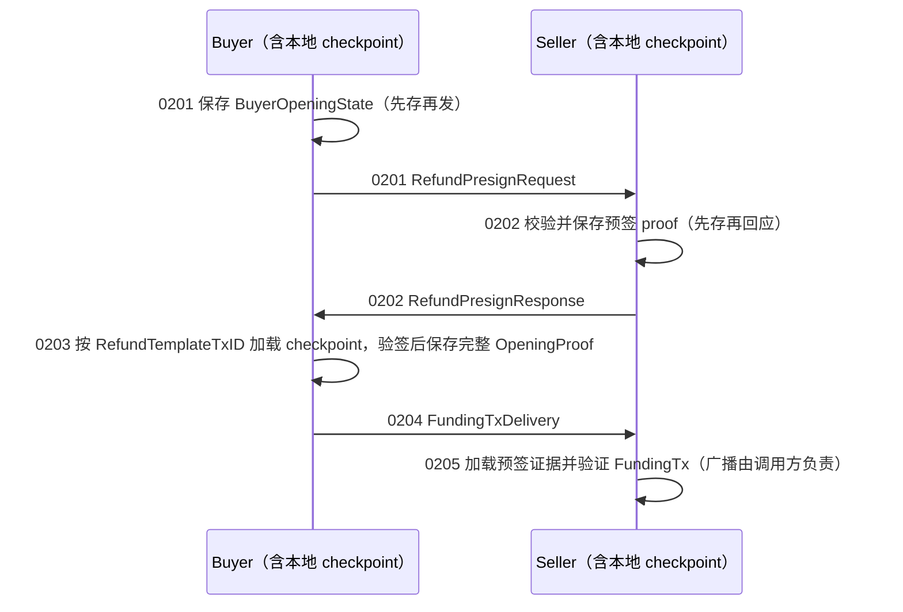

# 002：开启费用池

002 按一个角色的一次业务动作拆开。三个真正的协议报文保持原样，并通过 `wire` 严格编解码：



go-bitfs SDK 在本流程中完全无状态：workflow 只持有官方 BSV 私钥，每个方法只做显式输入到计算结果的转换，不加载、不保存、不广播。跨进程需要延续的本地角色状态由 demo 自己的 JSON checkpoint 保存（`demo/.state` 或 `$DEMO_02_STATE_DIR`），只按统一关联 ID `RefundTemplateTxID` 定位，不依赖 session。这些 checkpoint 只是示例应用行为，不是 SDK 能力或生产建议：它是直接整文件写入的简单实现，没有原子性保证，不承诺并发、事务或崩溃安全；真实应用应使用自己的数据库与一致性策略。

目录和业务动作对应如下：

| 编号 | 角色 | 一次业务动作 | 输出 |
|---|---|---|---|
| `0201_buyer_build_refund_request` | buyer | `PreparePoolOpening` 返回 request + `BuyerOpeningState`；应用先把 state 存入 checkpoint，再发送 request | `RefundPresignRequest` |
| `0202_seller_accept_refund_request` | seller | `PresignPoolOpening` 返回 response + 卖方预签 proof；应用先把 proof 存入 checkpoint，再回应 response | `RefundPresignResponse` |
| `0203_buyer_accept_refund_response` | buyer | 应用按响应中的 RefundTemplateTxID 加载 0201 checkpoint 并显式传入 SDK；验签返回完整 opening proof 和初始付款状态，应用保存 proof | `REFUND_TEMPLATE_TXID_HEX` |
| `0204_buyer_build_funding_delivery` | buyer | 应用按 RefundTemplateTxID 从 checkpoint 加载完整 OpeningProof，显式传入构造资金交易交付报文 | `FundingTxDelivery` |
| `0205_seller_accept_funding_delivery` | seller | 应用按 delivery.RefundTemplateTxID 加载 0202 预签证据并显式传入；SDK 返回验证后的 proof、初始付款状态和待广播交易原文，广播是调用方职责 | `POOL_OPENED=true` 等 |

0203 得到的完整 OpeningProof 和 0205 得到的初始付款状态是保存在各自 checkpoint 里的本地结果，不是额外的网络报文。0202 响应显式携带费用池统一关联 ID `RefundTemplateTxID`（未签名规范 RefundTx 的交易 ID）；0201 不单独携带 `FundingTxID`，卖方从 RefundTx 输入推导它。本地 checkpoint 与 wire 报文严格分离：checkpoint 只在各角色的进程内读写，不进入 stdin/stdout 管道。0203 只凭响应中的 `REFUND_TEMPLATE_TXID_HEX` 就能从买方 checkpoint 找回原 request 与私有 FundingTx，完整 OpeningProof 保存在买方自己的 checkpoint；只有 0203 成功落盘后，0204 才把原始 FundingTx 放入 `FundingTxDelivery`。

## 按报文顺序运行

每次演示建议使用新的状态目录。私钥和公共配置仍由 `demo/.env` 提供：

```sh
STATE_DIR=$(mktemp -d)
REQUEST=$STATE_DIR/0201-request.txt
RESPONSE=$STATE_DIR/0202-response.txt
HASH=$STATE_DIR/0203-refund-template-txid.txt
DELIVERY=$STATE_DIR/0204-funding-delivery.txt

DEMO_02_STATE_DIR="$STATE_DIR" \
  go run ./demo/02_pool_opening/0201_buyer_build_refund_request \
  | tee "$REQUEST"

DEMO_02_STATE_DIR="$STATE_DIR" \
  go run ./demo/02_pool_opening/0202_seller_accept_refund_request \
  < "$REQUEST" | tee "$RESPONSE"

DEMO_02_STATE_DIR="$STATE_DIR" \
  go run ./demo/02_pool_opening/0203_buyer_accept_refund_response \
  < "$RESPONSE" | tee "$HASH"

DEMO_02_STATE_DIR="$STATE_DIR" \
  go run ./demo/02_pool_opening/0204_buyer_build_funding_delivery \
  < "$HASH" | tee "$DELIVERY"

DEMO_02_STATE_DIR="$STATE_DIR" \
  go run ./demo/02_pool_opening/0205_seller_accept_funding_delivery \
  < "$DELIVERY"
```

程序的报文/状态输出在 stdout，角色日志在 stderr，因此 `tee` 保存的是可继续传递的 hex 报文。0203 只读取 0202 响应：应用从响应取出 `RefundTemplateTxID`，按它加载 0201 保存的 `BuyerOpeningState`（原 request 和私有 FundingTx），连同响应一起显式传给 SDK；SDK 重新派生 hash、拒绝一切错配，并针对原请求验证卖方签名。跨进程、无 session、无需原请求文件，全部由调用方状态承载。任何一步失败都可以带着同样的报文与 checkpoint 重跑该命令：SDK 不缓存中间状态，也不会产生隐式副作用。

## 0201 的真实 UTXO 和网络选择

0201 在 buyer 应用层自己调用 JungleBus，不增加 go-bitfs 内部的 hook 或接口。JungleBus 的地址接口提供交易历史而不是余额/UTXO 快照，因此 demo 会下载相关交易的原始 bytes，按 outpoint 追踪输入和输出，重建地址当前的已确认 UTXO。它会：

1. 在任何 JungleBus 查询前根据 `BITFS_NETWORK` 推导并显示当前网络的 P2PKH 地址，方便充值；
2. 根据 `BITFS_NETWORK` 选择地址并查询 JungleBus 地址历史；
3. 获取历史交易原文，匹配地址的 locking script，删除已被后续输入花费的 outpoint，再从剩余 UTXO 中选择可用输出；
4. 生成并签名真实输入的 FundingTx，再把它用于 `RefundPresignRequest`。

`BITFS_NETWORK` 可设为 `mainnet` 或 `testnet`，未设置时默认为 `testnet`。`JUNGLEBUS_BASE_URL` 可用于测试替代 API 地址；为空时，mainnet 使用 `https://junglebus.gorillapool.io`，testnet 使用 `https://testnet.junglebus.gorillapool.io`。JungleBus 不提供费率推荐，因此 `DEMO_02_MINER_FEE_RATE_SAT_PER_KB` 使用环境变量覆盖；未设置时 demo 使用 `100 sat/KB` 默认值。该值是 FundingTx 和开池退款交易共用的矿工费率，不是费用池服务费。0201 根据签名后 FundingTx 的实际字节数计算最终矿工费，并将剩余金额作为找零。

0201 的 `PreparePoolOpening` 同时返回 wire 报文和买方私有 `BuyerOpeningState`（含 FundingTx 原文）。demo 先把该状态写入买方 checkpoint，然后才把 request 发送给卖方。三个 checkpoint 文件都位于 `$DEMO_02_STATE_DIR` 下：

- `buyer-opening-checkpoint.json`：0201 的买方私有状态（原 request 与 FundingTx）；
- `buyer-opening-proof.json`：0203 得到的买方完整 OpeningProof；
- `seller-presign-proof.json`：0202 的卖方预签证据。

卖方在 0202 中只收到 `RefundPresignRequest`，只能从 RefundTx 输入推导 FundingTxID，尚未收到 FundingTx 原文；0203 按 RefundTemplateTxID 从买方 checkpoint 取回原交易，0204 才交付原始 FundingTx。

这个 demo 不会自动向网络广播 FundingTx：SDK 不执行任何提交动作，真实应用在此处调用自己的节点适配器完成广播与链上对账，尤其不要把 mainnet 生成的交易误认为已经提交。0205 输出的 `INITIAL_REFUND_TX_HEX` 是验证后的初始退款交易原文，供脚本观察待广播的结果形态，不是新的网络报文。JungleBus 地址历史返回 HTTP 404 时按该地址没有已确认交易处理；未确认交易和链重组不在这个最小 demo 的 UTXO 投影范围内。
