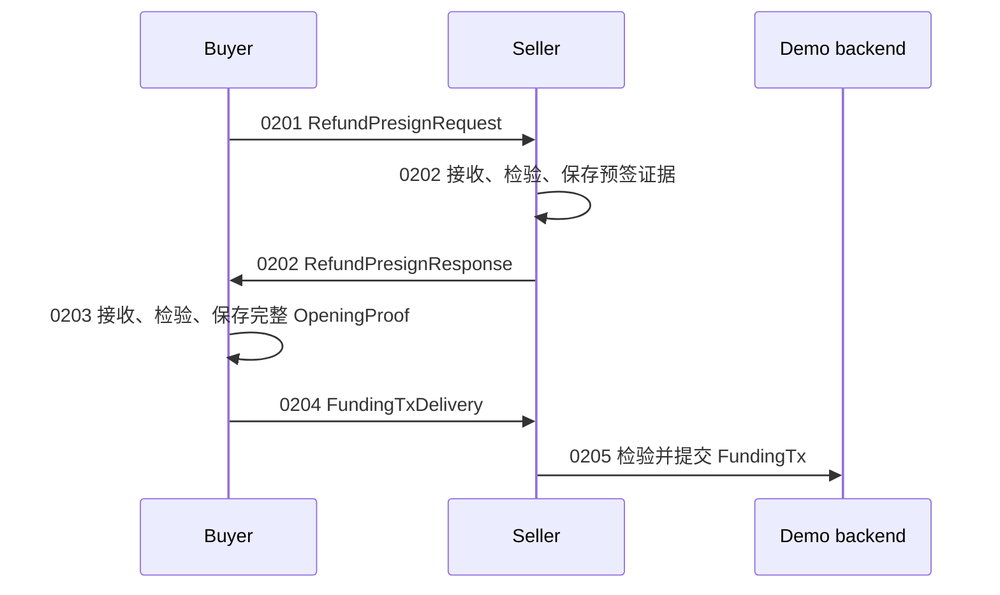

# 002：开启费用池

002 现在按“一个角色的一次业务动作”拆开。三个真正的协议报文保持原样，并通过 `wire` 严格编解码：



目录和业务动作对应如下：

| 编号 | 角色 | 一次业务动作 | 输出 |
|---|---|---|---|
| `0201_buyer_build_refund_request` | buyer | 接受开池参数，构造并签名退款预签名请求 | `RefundPresignRequest` |
| `0202_seller_accept_refund_request` | seller | 接收、检验请求，签名退款交易并回应 | `RefundPresignResponse` |
| `0203_buyer_accept_refund_response` | buyer | 接收、检验卖方回应，持久化完整 opening proof 和初始状态 | 本地 `OpeningProof` |
| `0204_buyer_build_funding_delivery` | buyer | 确认本地退款证据已保存，构造资金交易交付报文 | `FundingTxDelivery` |
| `0205_seller_accept_funding_delivery` | seller | 接收、检验资金交易，提交给后端并完成开池 | 本地 `PoolOpened` 状态 |

0203 的 `OpeningProof` 和 0205 的 `PoolOpened` 是本地状态，不是额外的网络报文。Funding transaction 在 0201 的报文中只以 `FundingTxID` 出现；只有 0203 成功保存退款证据后，0204 才把原始 FundingTx 放入 `FundingTxDelivery`。

## 按报文顺序运行

每次演示建议使用新的状态目录。私钥和公共配置仍由 `demo/.env` 提供：

```sh
STATE_DIR=$(mktemp -d)
REQUEST=$STATE_DIR/0201-request.txt
RESPONSE=$STATE_DIR/0202-response.txt
PROOF=$STATE_DIR/0203-buyer-proof.txt
DELIVERY=$STATE_DIR/0204-funding-delivery.txt

DEMO_02_STATE_DIR="$STATE_DIR" \
  go run ./demo/02_pool_opening/0201_buyer_build_refund_request \
  | tee "$REQUEST"

DEMO_02_STATE_DIR="$STATE_DIR" \
  go run ./demo/02_pool_opening/0202_seller_accept_refund_request \
  < "$REQUEST" | tee "$RESPONSE"

DEMO_02_STATE_DIR="$STATE_DIR" \
  go run ./demo/02_pool_opening/0203_buyer_accept_refund_response \
  --request-file "$REQUEST" < "$RESPONSE" | tee "$PROOF"

DEMO_02_STATE_DIR="$STATE_DIR" \
  go run ./demo/02_pool_opening/0204_buyer_build_funding_delivery \
  < "$PROOF" | tee "$DELIVERY"

DEMO_02_STATE_DIR="$STATE_DIR" \
  go run ./demo/02_pool_opening/0205_seller_accept_funding_delivery \
  < "$DELIVERY"
```

程序的报文/状态输出在 stdout，角色日志在 stderr，因此 `tee` 保存的是可继续传递的 hex 报文。0203 需要同时看到原始 0201 请求和 0202 响应，因为 `RefundPresignResponse` 只携带卖方签名，买方必须把它和原请求重新绑定后才能验签。

## 0201 的真实 UTXO 和网络选择

0201 在 buyer 应用层自己调用 JungleBus，不增加 go-bitfs 内部的 hook 或接口。JungleBus 的地址接口提供交易历史而不是余额/UTXO 快照，因此 demo 会下载相关交易的原始 bytes，按 outpoint 追踪输入和输出，重建地址当前的已确认 UTXO。它会：

1. 在任何 JungleBus 查询前根据 `BITFS_NETWORK` 推导并显示当前网络的 P2PKH 地址，方便充值；
2. 根据 `BITFS_NETWORK` 选择地址并查询 JungleBus 地址历史；
3. 获取历史交易原文，匹配地址的 locking script，删除已被后续输入花费的 outpoint，再从剩余 UTXO 中选择可用输出；
4. 生成并签名真实输入的 FundingTx，再把它用于 `RefundPresignRequest`。

`BITFS_NETWORK` 可设为 `mainnet` 或 `testnet`，未设置时默认为 `testnet`。`JUNGLEBUS_BASE_URL` 可用于测试替代 API 地址；为空时，mainnet 使用 `https://junglebus.gorillapool.io`，testnet 使用 `https://testnet.junglebus.gorillapool.io`。JungleBus 不提供费率推荐，因此 `DEMO_02_MINER_FEE_RATE_SAT_PER_KB` 使用环境变量覆盖；未设置时 demo 使用 `100 sat/KB` 默认值。该值是 FundingTx 和开池退款交易共用的矿工费率，不是费用池服务费。0201 根据签名后 FundingTx 的实际字节数计算最终矿工费，并将剩余金额作为找零。0201 会把真实 FundingTx 保存到买家本地的 `DEMO_02_FUNDING_TX_FILE`，默认是 `$DEMO_02_STATE_DIR/buyer-funding-tx.hex`；卖方看到的 0201 报文仍只有 `FundingTxID`，0203 从本地文件取回原交易，0204 才交付原始 FundingTx。

这个 demo 不会自动向 JungleBus 或网络广播 FundingTx，尤其不要把 mainnet 生成的交易误认为已经提交。0205 仍使用内存 DemoBackend，只观察 seller 对完整交易的接收和校验边界。JungleBus 地址历史返回 HTTP 404 时按该地址没有已确认交易处理；未确认交易和链重组不在这个最小 demo 的 UTXO 投影范围内。

这里的 backend 仍然是内存 demo backend，不会广播真实交易；0205 的提交只用于观察 seller 到节点/费用池后端的边界。完成后可在 `$STATE_DIR/buyer-pool.json` 和 `$STATE_DIR/seller-pool.json` 查看两方各自保存的开池证据。
