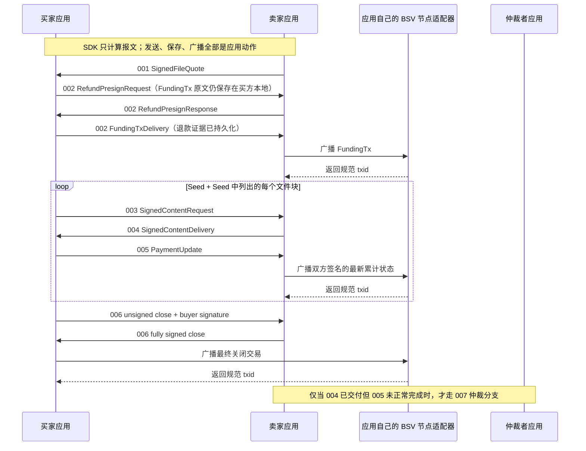

# 使用 go-bitfs SDK 完成一次文件购买业务（伪代码）

本文给出一个可直接映射为 Go 代码的端到端业务实现：卖家发布文件报价，买家建立 2-of-3 支付池，先购买 Seed，再按 Seed 顺序购买全部文件块，每块交付后完成一次累计付款，最后双方协商关闭支付池。

示例调用的是本仓库当前公开 API，而不是重新实现协议。go-bitfs 是**无状态、无基础设施副作用的协议 SDK**：Workflow 只持有构造时传入的官方 BSV 私钥（`WorkflowConfig{PrivateKey}`），只做协议计算与验证。数据库、事务、锁、内容仓库、节点广播、时间源和区块高度来源全部由业务应用提供。

## 1. 业务目标与成功条件

本次业务使用三个角色：

- 买家：支付并接收文件；
- 卖家：提供报价、Seed 和文件块；
- 仲裁者：作为支付池第三方公钥参与开户，仅在异常分支中签名。

为使主线清晰，本例购买的是非空文件；空文件的报价要求 `SeedHash` 为空，业务层应直接发布空结果，不进入购买 Seed/文件块的循环。

正常业务成功必须同时满足：

1. 买家接受了卖家签名的 001 报价；
2. 双方先持久化各自的退款证据与私有状态，再广播资金交易，完成 002 开池；
3. 每轮都严格执行 003 请求、004 交付、005 累计付款；
4. 下载后的文件通过 MasterSeed 完整校验；
5. 双方完成 006 协商关池；最终交易由应用自己的节点适配器广播并被接受。

主流程如下：



## 2. SDK 与应用边界

| 能力 | 负责方 | 本例使用的接口 |
|---|---|---|
| 报价、内容凭证、定价和签名校验 | go-bitfs | `seller.Workflow`、`buyer.Workflow`、`bitfs` |
| 支付池交易构造、解析、签名合并 | go-bitfs | `pool.MultisigPoolEngine`（纯函数） |
| 规范 CBOR 编解码 | go-bitfs | `wire.Marshal*`、`wire.Unmarshal*` |
| 私钥保管 | 应用 | 官方 BSV SDK 私钥（Go：`github.com/bsv-blockchain/go-sdk/primitives/ec` 的 `*ec.PrivateKey`；TS：`@bsv/sdk` 的 `PrivateKey`），经 `WorkflowConfig{PrivateKey}` 构造传入 |
| FundingTx 构建和签名 | 应用钱包 | `Wallet.BuildSignedFundingTransaction`（本文伪接口） |
| 全部本地角色状态持久化 | 应用数据库 | `PurchaseJournal`（本文伪接口），以 `RefundTemplateTxID` 为键 |
| Seed、文件块读取与下载结果存储 | 应用 | `ContentRepository`（本文伪接口） |
| 时间源与区块高度来源 | 应用 | SDK 每个入口内部读取一次系统 UTC；区块高度以显式 `blockHeight uint32` 参数由应用提供 |
| 节点广播与链上对账 | 应用 | `NodeBroadcaster`（本文伪接口） |
| HTTP、队列、WebSocket | 应用 | 传递 `wire.Kind` 和原始 `Packet.CBOR` |

> go-bitfs 不提供任何 Store、Repository、租约或后端实现。若买卖双方是独立服务，各自持有自己的本地状态即可——SDK 从不依赖共享存储。

### 2.1 应用侧推荐顺序

每个协议步骤都遵循同一顺序，这是接入本 SDK 的核心纪律：

```
load（按 RefundTemplateTxID 加载本地状态）
→ SDK compute/verify（显式传入全部前序证据）
→ persist intent/result（先保存返回的报文与状态）
→ send/broadcast（通过自己的传输与节点适配器）
→ record outcome（记录 txid 与最终结果）
```

“先保存、再发送”适用于每一条对外报文；“先持久化 raw 与 canonical txid、再调用自己的广播器”适用于每一笔交易。

## 3. 应用需要实现的适配器

下面均为应用层伪代码。

### 3.1 私钥构造参数

SDK 没有 signer 接口或注入点：私钥是 workflow 的构造参数，而不是运行时钩子。

```go
// 每个角色用自己的官方 BSV 私钥构造一个 workflow。
// buyer、seller、arbiter 必须分别创建实例，不能混用角色密钥；
// 构造器拒绝 nil 私钥，并从私钥派生压缩公钥完成角色绑定。
buyerWorkflow, _ := buyer.NewWorkflow(buyer.WorkflowConfig{PrivateKey: buyerKey})
```

所有签名走 SDK 固定路径：被签字节（001/003 的 canonical 条款 CBOR，或 004 的精确 32 字节授权哈希）用 SHA-256 哈希一次，
`(*ec.PrivateKey).Sign` 对这份已算好的摘要签名（Go 侧接收预计算 digest；TS 侧
`PrivateKey.sign(message)` 会自行哈希，跨语言向量必须避免双哈希），返回 low-S DER
并由固定验证器按派生角色公钥复验。资金池交易签名使用固定的 MultisigPool sighash
（`ForkID|All`），绝不二次哈希。

注意：HSM 或钱包可能为同一摘要产生不同但都有效的 DER 签名，SDK 不承诺 exactly-once 签名。应用应在对外发送前保存第一次成功结果，重试时优先重放已保存结果（见第 9 节）。

### 3.2 内容仓库

内容字节永远不经过 SDK 的存储钩子：调用方在调用前读出、作为参数传入，验证后的内容也由 SDK 作为返回值交还、由调用方落盘。

```go
// SellerContentRepository 保存卖家预先生成的 Seed 和文件块。
type SellerContentRepository struct{ /* ... */ }

func (r *SellerContentRepository) LoadSeed(seedHash masterseed.Digest) ([]byte, error)
func (r *SellerContentRepository) LoadBlock(blockHash masterseed.Digest) ([]byte, error)

// BuyerContentStore 保存买家已验证的内容。只有保存成功后，
// 业务才允许把对应的 005 更新标记为可继续推进。
type BuyerContentStore struct{ /* ... */ }

func (s *BuyerContentStore) SaveVerifiedContent(contentHash [32]byte, payload []byte) error
```

### 3.3 节点广播适配器

广播、超时判定和链上对账完全属于应用。SDK 只会返回待广播的交易原文和规范 txid。

```go
// NodeBroadcaster 是应用自己的节点适配器。它声明"节点是否接受"，
// 这是 SDK 绝不代言的能力。
type NodeBroadcaster struct{ /* ... */ }

// Broadcast 先把 (raw, canonicalTxID) 写入应用的 outbox 表，再提交节点。
// 超时或结果不确定时，由调用方按 txid/outpoint 查询节点并对账，
// outbox 记录保证可以安全地重播同一笔交易。
func (b *NodeBroadcaster) Broadcast(raw []byte) (canonicalTxID [32]byte, err error) {
    transaction, err := pool.ParseCanonicalTransaction(raw)
    if err != nil {
        return [32]byte{}, err
    }
    txID := transaction.TxID().CloneBytes()
    if err := b.outbox.Save(txID, raw); err != nil {
        return [32]byte{}, err
    }
    return b.rpc.SendRawTransaction(raw)
}

// 区块高度来源。退款交易使用区块高度 nLockTime 时，应用必须提供一个
// 自己认可的当前高度；绝不能为了绕过失败而伪造 0 继续执行退款。
func (b *NodeBroadcaster) CurrentBlockHeight(ctx context.Context) (uint32, error)
```

### 3.4 原始协议流水

应用需要按 `RefundTemplateTxID` 保存每一步返回值，用于崩溃恢复、审计和 007 仲裁：

```go
// PurchaseJournal 是应用的业务状态库。表结构建议：
//
//   pools(refund_template_txid PRIMARY KEY, role, opening_proof, latest_payment, ...)
//   buyer_openings(refund_template_txid PRIMARY KEY, request_cbor, funding_tx)
//   delivery_states(refund_template_txid PRIMARY KEY, auth_hash,
//                   target_sequence, seller_amount_after_sat)
//   journal(id, refund_template_txid, kind, cbor/raw, created_at)
type PurchaseJournal struct{ /* ... */ }

func (j *PurchaseJournal) LoadBuyerOpeningState(refundTemplateTxID [32]byte) (*buyer.BuyerOpeningState, error)
func (j *PurchaseJournal) SaveBuyerOpeningState(state *buyer.BuyerOpeningState) error   // 0201 之后立即调用
func (j *PurchaseJournal) SaveSellerPresignProof(proof *pool.OpeningProof) error         // 0202 之后立即调用
func (j *PurchaseJournal) SaveOpening(role string, proof *pool.OpeningProof) error       // 0203/0205 之后
func (j *PurchaseJournal) SaveLatestPayment(role string, state *pool.PaymentState) error // 每次 005 合并完成后
func (j *PurchaseJournal) SaveDeliveryState(state *seller.ContentDeliveryState) error    // 每次生成 004 后
func (j *PurchaseJournal) LoadDeliveryState(refundTemplateTxID [32]byte) (*seller.ContentDeliveryState, error)
func (j *PurchaseJournal) RecordOutbox(kind string, payload []byte) error                // 发送前的 wire 报文留痕
```

并发串行化同样由应用完成：同一 `RefundTemplateTxID` 的后续报文必须串行处理（数据库唯一键 + 行锁或单队列）。SDK 无锁，两次并发调用会产生两份各自合法的计算结果，去重是应用的责任。

## 4. 卖家预处理文件

```go
ctx := context.Background()

// 内容仓库在报价之前准备好 Seed 与文件块；SDK 不读取磁盘。
seed, fileBytes := contentRepo.PrepareMasterSeedAndBlocks("bigfile.bin")

// 报价有效期由应用计算；SDK 在 CreateQuote 入口内部读取一次系统 UTC 校验未过期。
arbiters, _ := bitfs.EncodeSupportedArbiterPubkeys([][]byte{arbiterPubKey})
quote, err := sellerWorkflow.CreateQuote(ctx, bitfs.FileQuoteTerms{
    SeedHash:                     masterseed.Sum256(seed).Bytes(),
    BuyerPubkey:                  buyerPubKey,
    SeedPriceSat:                 100,
    FullBlockPriceSat:            1000,
    FileSize:                     uint64(len(fileBytes)),
    QuoteExpiresAtUnix:           time.Now().UTC().Add(24 * time.Hour).Unix(),
    SupportedArbiterPubkeysCBOR:  arbiters,
}, "bigfile.bin")
if err != nil { /* ... */ }

journal.RecordOutbox("quote", must(bitfs.EncodeSignedFileQuote(quote)))
```

`CreateQuote` 在入口处读取一次系统 UTC 并以此签名条款、校验未过期，返回完整凭证；保存它是应用的职责。

## 5. 初始化一次业务会话

```go
// 每个 workflow 只需要构造时传入一把官方 BSV 私钥；没有 Store、Backend、Clock、Signer。
buyerWorkflow, _ := buyer.NewWorkflow(buyer.WorkflowConfig{PrivateKey: buyerKey})
sellerWorkflow, _ := seller.NewWorkflow(seller.WorkflowConfig{PrivateKey: sellerKey})
arbiterWorkflow, _ := arbitration.NewWorkflow(arbitration.WorkflowConfig{PrivateKey: arbiterKey})
```

买家接受报价（SDK 在入口内部读取一次系统 UTC 验证签名与有效期，返回条款；不保存）：

```go
terms, err := buyerWorkflow.AcceptQuote(ctx, quote)
```

## 6. 端到端正常流程

### 6.1 002 开池（0201–0205）

```go
fundingTx := wallet.BuildSignedFundingTransaction(buyerPubKey, sellerPubKey, arbiterPubKey, poolOutputSat)

// 0201：SDK 返回 wire 报文与买方私有状态。应用先保存 State，再发送 Request。
preparation, err := buyerWorkflow.PreparePoolOpening(ctx, pool.OpeningInput{
    FundingTx:            fundingTx,
    ExpiryLockTime:       uint32(time.Now().Add(time.Hour).Unix()),
    MinerFeeRateSatPerKB: feeRate,
    SellerPubKey:         sellerPubKey,
    ArbiterPubKey:        arbiterPubKey,
})
if err != nil { /* ... */ }
journal.SaveBuyerOpeningState(preparation.State) // 先保存，再发送
rawRequest, err := wire.MarshalPoolRefundPresignRequest(preparation.Request)
if err != nil { return err }
sendToSeller(rawRequest)

// 卖方收到字节后先解码再验证。
decodedRequest, err := wire.UnmarshalPoolRefundPresignRequest(recvRaw())
if err != nil { return err }

// 0202：卖方验证请求并预签。应用先保存 Opening，再发送 Response。
presignResult, err := sellerWorkflow.PresignPoolOpening(ctx, decodedRequest)
if err != nil { /* ... */ }
journal.SaveSellerPresignProof(presignResult.Opening) // 先保存，再回应
rawResponse, err := wire.MarshalPoolRefundPresignResponse(presignResult.Response)
if err != nil { return err }
sendToBuyer(rawResponse)

// 0203：买家按响应中的 RefundTemplateTxID 加载 0201 私有状态，显式传回 SDK。
response := recvFromSeller()
state, err := journal.LoadBuyerOpeningState(response.RefundTemplateTxID)
if err != nil { /* 找不到本地状态时：延迟、重试、死信或拒绝，由应用决定 */ }
acceptance, err := buyerWorkflow.AcceptRefundPresign(ctx, state, response)
if err != nil { /* 哈希错配或签名无效：拒绝该响应 */ }
journal.SaveOpening("buyer", acceptance.Opening)          // 含 FundingTx 的完整 proof
journal.SaveLatestPayment("buyer", acceptance.InitialPayment)

// 0204：用已验证 proof 构造交付报文。
delivery, err := buyerWorkflow.BuildFundingTxDelivery(ctx, acceptance.Opening)
if err != nil { /* ... */ }
rawDelivery, err := wire.MarshalPoolFundingTxDelivery(delivery)
if err != nil { return err }
journal.RecordOutbox("funding_delivery", rawDelivery)
sendToSeller(rawDelivery)

// 0205：卖方用自己保存的预签证据验证资金交付。
decodedDelivery, err := wire.UnmarshalPoolFundingTxDelivery(recvRaw())
if err != nil { return err }
presignProof, err := journal.LoadSellerPresignProof(decodedDelivery.RefundTemplateTxID)
if err != nil { /* ... */ }
opened, err := sellerWorkflow.AcceptPoolFunding(ctx, presignProof, decodedDelivery)
if err != nil { /* ... */ }
journal.SaveOpening("seller", opened.Opening)
journal.SaveLatestPayment("seller", opened.InitialPayment)

// 广播资金交易：应用先持久化 raw 与 canonical txid，再调用节点适配器。
_, err = broadcaster.Broadcast(opened.FundingTx)
if isTimeout(err) { /* 按 txid 对账后再决定是否重播；不要盲目重签 */ }
```

### 6.2 单次"请求—交付—付款"（003–005）

以下函数每次迭代都以应用数据库中的最新状态为输入：

```go
func purchaseOneRound(journal *PurchaseJournal, blockHeight uint32) error {
    ctx := context.Background()
    quote := journal.LoadQuote()
    opening := journal.LoadOpening("buyer")
    previous := journal.LoadLatestPayment("buyer") // 上一步保存的已合并状态

    // 003：引用、批量价格、余额、序号全部基于显式传入的状态校验。
    // 一个付款序号授权一组有序内容 hash；类型由证据推导，不由调用方声明。
    input := buyer.ContentRequestInput{
        ContentHashes:    wantedHashes, // 1..64 个有序 hash；含块时必须携带已验证 seed
        // SDK 在操作入口自取一次 UTC；deadline 相对当前时间设置即可。
        DeliveryDeadline: bitfs.UnixSeconds(time.Now().UTC().Add(30 * time.Minute).Unix()),
        Seed:             buyerSeedForBlock, // 批次包含任何块时必须提供
        BlockHeight:      blockHeight,       // 仅块高锁定的退款使用
    }
    request, err := buyerWorkflow.BuildContentRequest(ctx, quote, opening, previous, input)
    if err != nil { return err }

    rawRequest, err := wire.MarshalContentRequest(request)
    if err != nil { return err }
    authHash := must(bitfs.PaymentAuthorizationHash(request.TermsCBOR))
    journal.RecordOutbox("content_request", rawRequest) // 发送前留痕：007 需要
    sendToSeller(rawRequest)

    // 004：卖方验证整批授权，逐项校验 payload 后对裸授权哈希签名，原子交付。
    delivery, deliveryState, err := sellerWorkflow.BuildContentDelivery(ctx,
        sellerQuote, sellerOpening, sellerPrevious, decodedRequest,
        seller.ContentDeliveryInput{
            ContentPayloads: loadedPayloadBatch, // 顺序与 003 hashes 一一对应
            Seed:            repoSeed,           // 批次包含任何块时必须提供
            BlockHeight:     blockHeight,
        },
    )
    if err != nil { return err }
    journal.SaveDeliveryState(deliveryState) // 先保存交付上下文，再发送 004
    rawDelivery, err := wire.MarshalContentDelivery(delivery)
    if err != nil { return err }
    sendToBuyer(rawDelivery)

    // 买家按 PaymentAuthorizationHash 路由 004 到本地保存的原始 003 后全量
    // 验收；payload 批次是数据，落盘由应用完成。
    verified, err := buyerWorkflow.AcceptDelivery(ctx, quote, opening, previous,
        decodedRequest, decodedDelivery,
        buyer.ContentDeliveryInput{
            Seed:        localSeed,
            BlockHeight: blockHeight,
        },
    )
    if err != nil { return err }
    for index, payload := range verified.Payloads {
        if err := contentStore.SaveVerifiedContent(wantedHashes[index], payload); err != nil {
            // 任一项保存失败都不得声称业务已完成；可复用同一验证结果重新落盘。
            return err
        }
    }

    // 005：卖方凭保存的 ContentDeliveryState 验证金额与序号，合并完整交易。
    update := verified.Update
    signedPayment, err := sellerWorkflow.AcceptPayment(ctx, sellerOpening,
        sellerPrevious, loadedDeliveryState, update, blockHeight)
    if err != nil { return err }
    journal.SaveLatestPayment("seller", &signedPayment.State) // 先保存，再广播
    _, err = broadcaster.Broadcast(signedPayment.RawTx)
    return err
}
```

区块高度由应用从自己认可的节点适配器读取后显式传入；系统时间由 SDK 在每次操作入口内部读取一次 `time.Now().UTC()` 并复用，公开 API 不接收时间参数。SDK 不查节点，也不评估调用方高度的可信度。

### 6.3 006 协商关池

```go
base := journal.LoadLatestPayment("buyer")

// 买家构造最终未签名交易和自己的分离签名。
// base 与目标金额都是调用方的业务决定；SDK 只验证协议边界。
unsigned, buyerSig, err := buyerWorkflow.BuildImmediateClose(ctx, opening, base, targetSellerAmountSat, blockHeight)
if err != nil { /* ... */ }

// 卖家验证买家签名、补充卖方签名并合并；不广播。
closed, err := sellerWorkflow.SignImmediateClose(ctx, sellerOpening, unsigned, buyerSig, blockHeight)
if err != nil { /* ... */ }

// 买家复核完整最终交易；广播由买家执行。
final, err := buyerWorkflow.CompleteImmediateClose(ctx, buyerOpening, closed)
if err != nil { /* ... */ }
journal.SaveLatestPayment("buyer", &final.State)
_, err = broadcaster.Broadcast(final.RawTx)
```

到期退款路径同样只是计算：

```go
// SDK 只验证 opening、退款模板与锁定条件；是否存在业务冲突由应用判断。
raw, state, err := buyerWorkflow.BuildRefundAfterExpiry(ctx, opening, blockHeight)
if err != nil { /* ... */ }
_, err = broadcaster.Broadcast(raw)
```

### 6.4 007 仲裁分支（004 已交付但 005 未完成）

```go
authorization := journal.LoadSentContentRequest(refundTemplateTxID) // 003 时留痕的原始 CBOR
arbitrationRequest, err := sellerWorkflow.BuildArbitrationRequest(ctx,
    sellerOpening, authorization, sellerBase, blockHeight)
if err != nil { /* ... */ }
rawRequest, err := arbitration.MarshalRequest(arbitrationRequest)
if err != nil { /* ... */ }

decodedArbitrationRequest, err := arbitration.UnmarshalRequest(rawRequest)
if err != nil { /* ... */ }
response, err := arbiterWorkflow.SignPayment(arbiterCtx, decodedArbitrationRequest)
if err != nil { /* ... */ }

signed, err := sellerWorkflow.CompleteArbitratedPayment(ctx,
    sellerOpening, sellerPrevious, arbitrationRequest, response, blockHeight)
if err != nil { /* ... */ }
journal.SaveLatestPayment("seller", &signed.State)
_, err = broadcaster.Broadcast(signed.RawTx)
```

## 7. 错误分类与重试策略

| 场景 | 正确做法 |
|---|---|
| 签名成功但应用保存失败 | 重试时优先重放已保存结果；没有保存成功则由密钥审计策略决定是否重签。无论签名字节如何变化，`RefundTemplateTxID` 仍从规范未嵌入签名 RefundTx 派生。 |
| 保存成功但发送失败 | 重发**同一份**已保存 wire bytes，不重新构造业务字段；对端按 RefundTemplateTxID 与完整证据验证，不依赖连接。 |
| 广播超时 / 结果不确定 | 应用先持久化 raw 与 canonical txid，再按 txid/outpoint 查询节点对账；outbox 保证可安全重播。SDK 不保存 uncertain 标记。 |
| 重复 / 乱序 / 并发报文 | 应用按 RefundTemplateTxID 路由与串行化；本地状态缺失时可延迟、重试、死信或拒绝；找到状态后与报文一起传入 SDK，SDK 会重新派生哈希并拒绝错配。 |
| stale sequence / 金额倒退 / wrong opening | SDK 返回协议错误（`ErrStalePaymentSequence` 等）；应用重新加载最新状态后决定重算、拒绝或转仲裁。SDK 不自动 reload。 |
| 多租户 | 先做账户授权再加载证据；`RefundTemplateTxID` 是路由 ID 不是授权令牌；SDK 会继续校验 signer 公钥与协议角色的绑定。 |

## 8. 分布式部署必须增加的状态同步

买卖双方是独立服务时，各自维护自己的状态即可，但必须遵守：

1. 所有跨步骤恢复所需的信息都在各自主体的数据库里：买方的 `BuyerOpeningState`、双方的 OpeningProof 与最新 PaymentState、卖方的 `ContentDeliveryState` 与 003 授权原文；
2. 每个跨网络动作前先持久化意图与材料（outbox），动作后记录结果；
3. 不要求多个网络步骤处于同一数据库事务；应用用自己的状态机衔接。

## 9. 验收清单

- [ ] Workflow 构造只剩 `{PrivateKey *ec.PrivateKey}` 一个字段，代码中不存在任何 Store/Backend 注入；
- [ ] 每一步都是：load → compute/verify → persist → send/broadcast → record；
- [ ] `RefundTemplateTxID` 是唯一关联键，所有查找与错配拒绝都围绕它展开；
- [ ] 区块高度来自应用认可的事实源并显式传入；时间由 SDK 内部读取一次 UTC；
- [ ] 内容字节由应用读取传入、验证结果由应用落盘；
- [ ] 广播超时的对账逻辑位于应用节点适配器中，且先于任何"已完成"声明。
