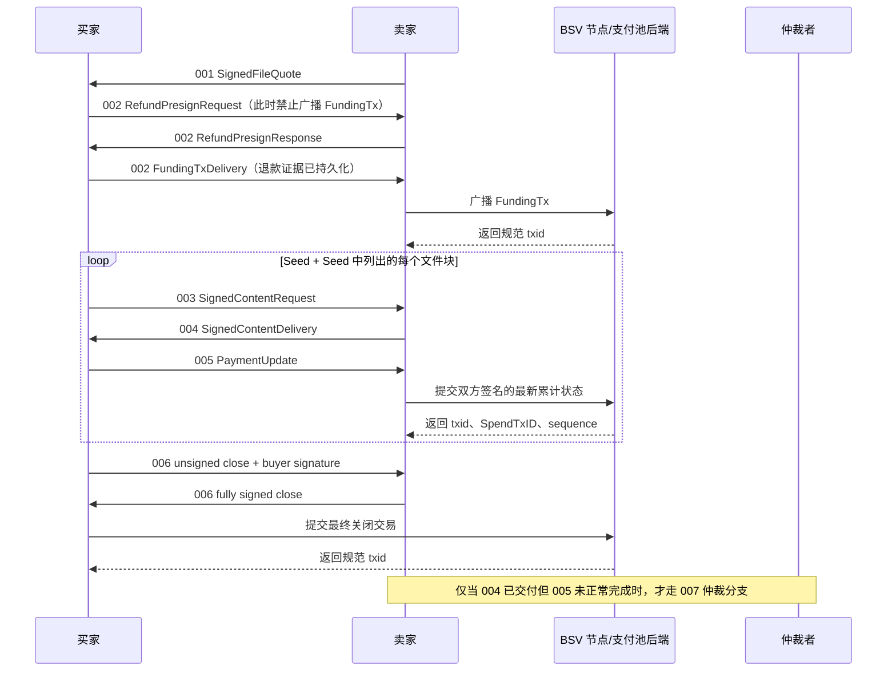

# 使用 go-bitfs SDK 完成一次文件购买业务（伪代码）

本文给出一个可直接映射为 Go 代码的端到端业务实现：卖家发布文件报价，买家建立 2-of-3 支付池，先购买 Seed，再按 Seed 顺序购买全部文件块，每块交付后完成一次累计付款，最后双方协商关闭支付池。

示例调用的是本仓库当前公开 API，而不是重新实现协议。钱包、私钥保管、文件存储、消息传输和 BSV 节点 RPC 仍由业务应用提供。

## 1. 业务目标与成功条件

本次业务使用三个角色：

- 买家：支付并接收文件；
- 卖家：提供报价、Seed 和文件块；
- 仲裁者：作为支付池第三方公钥参与开户，仅在异常分支中签名。

为使主线清晰，本例购买的是非空文件；空文件的报价要求 `SeedHash` 为空，业务层应直接发布空结果，不进入购买 Seed/文件块的循环。

正常业务成功必须同时满足：

1. 买家接受了卖家签名的 001 报价；
2. 买卖双方先持久化退款证据，再广播资金交易，完成 002 开池；
3. 每轮都严格执行 003 请求、004 交付、005 累计付款；
4. 下载后的文件通过 MasterSeed 完整校验；
5. 双方完成 006 协商关池，最终交易被节点接受。

主流程如下：



## 2. SDK 与应用边界

| 能力 | 负责方 | 本例使用的接口 |
|---|---|---|
| 报价、内容凭证、定价和签名校验 | go-bitfs | `seller.Workflow`、`buyer.Workflow`、`bitfs` |
| 支付池交易构造与状态机 | go-bitfs | `pool.MultisigPoolEngine`（由 Workflow 内部使用） |
| 规范 CBOR 编解码 | go-bitfs | `wire.Marshal`、`wire.Unmarshal*` |
| 私钥保管 | 应用 | `pool.Signer` |
| FundingTx 构建和签名 | 应用钱包 | `Wallet.BuildSignedFundingTransaction`（本文伪接口） |
| 报价和支付池持久化 | SDK 参考实现或应用数据库 | `bitfs.FileQuoteStore`、`pool.FileStore` |
| Seed、文件块和下载结果存储 | 应用 | `seller.ContentSource`、`buyer.ContentSink`、`buyer.SeedSource` |
| 原始协议流水和业务状态 | 应用 | `PurchaseJournal`（本文伪接口） |
| 广播和查询链高度 | 应用 | `pool.PoolBackend`，可选实现 `BlockHeight` |
| HTTP、队列、WebSocket | 应用 | 传递 `wire.Kind` 和原始 `Packet.CBOR` |

> 本例是一个单进程业务编排器，所以买家和卖家共享同一个 `pool.FileStore`。这与仓库集成测试的状态可见性一致，适合先实现完整业务。若买卖双方是独立服务，不能假设共享状态，详见第 10 节。

## 3. 应用需要实现的适配器

下面均为应用层伪代码。方法签名应保持与 SDK 接口一致。

### 3.1 私钥签名器

```go
// SDKSigner 让 go-bitfs 能使用某个角色的私钥，但绝不暴露私钥本身。
// buyer、seller、arbiter 必须分别创建实例，不能混用角色密钥。
type SDKSigner struct {
    key *ec.PrivateKey
}

func (s *SDKSigner) PublicKey(ctx context.Context) ([]byte, error) {
    if err := ctx.Err(); err != nil {
        return nil, err
    }

    // 协议只接受 33 字节压缩 secp256k1 公钥；65 字节非压缩公钥会被拒绝。
    return s.key.PubKey().Compressed(), nil
}

func (s *SDKSigner) Sign(ctx context.Context, digest []byte) ([]byte, error) {
    if err := ctx.Err(); err != nil {
        return nil, err
    }
    if len(digest) != 32 {
        return nil, errors.New("SDK 传入的签名摘要必须是 32 字节")
    }

    // digest 已由 go-bitfs 按对应协议计算完成：
    // 001/003/004 使用 canonical CBOR 的单次 SHA-256；
    // 支付池交易使用固定 sighash。这里禁止再次哈希。
    signature, err := s.key.Sign(digest)
    if err != nil {
        return nil, err
    }

    // 只返回 DER 签名；需要的 sighash 标记由支付池核心处理。
    return signature.Serialize(), nil
}
```

### 3.2 内容仓库

```go
// SellerContentRepository 保存卖家预先生成的 Seed 和文件块。
// 实际实现可以是对象存储、数据库或本地只读目录。
type SellerContentRepository interface {
    LoadSeed(ctx context.Context, hash masterseed.Digest) ([]byte, error)
    LoadBlock(ctx context.Context, hash masterseed.Digest) ([]byte, error)
}

// BuyerContentRepository 同时实现 buyer.ContentSink 和 buyer.SeedSource。
// AcceptDelivery 只会在完成签名、哈希、Seed 成员关系和大小校验后调用 SaveVerifiedContent。
type BuyerContentRepository interface {
    SaveVerifiedContent(ctx context.Context, hash bitfs.Hash32, payload []byte) error
    LoadSeed(ctx context.Context, hash masterseed.Digest) ([]byte, error)

    // 以下两个方法不是 SDK 接口，是业务组装文件时使用的本地查询方法。
    LoadVerified(ctx context.Context, hash masterseed.Digest) ([]byte, error)
    PublishCompletedFile(ctx context.Context, filename string, source io.Reader) error
}
```

持久化内容时应遵守两个规则：

- 以原始 32 字节 SHA-256 为主键，写入时复制 `payload`，不要持有 SDK 返回切片；
- 先写临时对象，落盘并校验成功后再原子发布，避免进程退出留下“看似完整”的文件。

### 3.3 节点后端

```go
// NodeBackend 必须实现 pool.PoolBackend。
// 本接口只负责把 SDK 已构造好的原始交易提交给节点，不得重新组装交易。
type NodeBackend struct {
    rpc BSVRPC
}

func (n *NodeBackend) SubmitTransaction(ctx context.Context, rawTx []byte) (pool.Hash32, error) {
    // 用于 FundingTx 广播。
    // 幂等要求：完全相同的交易已经在 mempool/chain 中时，仍返回相同规范 txid 和 nil。
    return n.rpc.BroadcastIdempotently(ctx, clone(rawTx))
}

func (n *NodeBackend) SubmitUpdate(ctx context.Context, rawTx []byte) (*pool.UpdateAcceptance, error) {
    // 节点或支付池服务接受非最终累计状态后，返回它实际接受的三个身份字段。
    // Workflow 内部会再次检查 txid、SpendTxID 和 PaymentSequence 是否与候选状态完全一致。
    result, err := n.rpc.SubmitNonFinalPoolState(ctx, clone(rawTx))
    if err != nil {
        return nil, err
    }
    return &pool.UpdateAcceptance{
        TxID:            result.TxID,
        SpendTxID:       result.SpendTxID,
        PaymentSequence: result.PaymentSequence,
    }, nil
}

func (n *NodeBackend) SubmitFinal(ctx context.Context, rawTx []byte) (pool.Hash32, error) {
    // 用于协商关闭或到期退款等最终交易。
    return n.rpc.SubmitFinalPoolState(ctx, clone(rawTx))
}

func (n *NodeBackend) BlockHeight(ctx context.Context) (uint32, error) {
    // 只有使用区块高度型 nLockTime 时需要；时间戳型到期由 SDK 使用 UTC 时间判断。
    return n.rpc.CurrentBlockHeight(ctx)
}
```

后端返回错误时，广播结果可能未知。Workflow 会把池标记为 `pool.ErrPoolStateUncertain`；此时必须查询节点并核对那一笔候选交易，不能直接发起下一次请求或再次签不同状态。

### 3.4 原始协议流水

`PendingRequestStore` 只负责并发租约，不保存完整的 003 授权。为了断点恢复、审计和 007 仲裁，应用还必须持久化发送或接收的原始 CBOR。

```go
type PurchaseJournal interface {
    // 每个方法都以业务 ID/SpendTxID、消息 Kind 和原始 CBOR 保存一条不可变记录。
    // 同一个消息哈希的重复写入必须幂等；不同字节不能覆盖旧记录。
    SaveOutbound(ctx context.Context, spendTxID pool.Hash32, kind wire.Kind, rawCBOR []byte) error
    SaveInbound(ctx context.Context, spendTxID pool.Hash32, kind wire.Kind, rawCBOR []byte) error

    // 保存节点已经接受的 sequence、累计金额和交易 ID；不得只记“付款成功”布尔值。
    MarkPaymentAccepted(
        ctx context.Context,
        spendTxID pool.Hash32,
        sequence uint32,
        sellerAmountSat uint64,
        txID pool.Hash32,
    ) error

    // 仲裁恢复时按原始 CBOR 解码，不能从数据库字段重新拼一个 SignedContentRequest。
    LoadContentRequestCBOR(ctx context.Context, spendTxID pool.Hash32, requestHash bitfs.Hash32) ([]byte, error)
}
```

流水中可能包含交付内容和交易证据，应加密存储、限制访问并设置与争议期匹配的保留周期。
实际传输层应对 001～007 的每个入站和出站消息统一记流水；第 6 节的循环函数重点展开与交付争议直接相关的 003～005 保存时点。

## 4. 卖家预处理文件

```go
func PrepareFileForSale(ctx context.Context, sourcePath string, sellerRepo SellerContentAdmin) SaleAsset {
    seedPath := sourcePath + ".seed"

    // MasterSeed 固定按 256 KiB 切块，Seed 内容是各块 SHA-256 原始字节的顺序拼接。
    seedInfo, err := masterseed.CreateSeedFile(
        ctx,
        sourcePath,
        seedPath,
        masterseed.CreateSeedFileOptions{},
    )
    must(err)

    // 业务层逐块读取源文件并以摘要索引。
    // 这里必须保存原始块，不要把十六进制摘要当成块内容。
    for blockIndex := uint64(0); blockIndex < seedInfo.BlockCount; blockIndex++ {
        blockBytes := readSourceBlock(sourcePath, blockIndex, masterseed.BlockSize)
        blockHash := masterseed.Sum256(blockBytes)
        must(sellerRepo.PutBlock(ctx, blockHash, blockBytes))
    }

    seedBytes := readAll(seedPath)
    must(sellerRepo.PutSeed(ctx, seedInfo.SeedHash, seedBytes))

    return SaleAsset{
        SourceSize: seedInfo.SourceSize,
        SeedHash:   seedInfo.SeedHash,
        BlockCount: seedInfo.BlockCount,
    }
}
```

## 5. 初始化一次业务会话

```go
func NewPurchaseSession(ctx context.Context, deps AppDependencies) *PurchaseSession {
    // FileQuoteStore 和 FileStore 是 SDK 自带的持久化参考实现。
    // 生产集群可以替换为实现相同接口的事务数据库。
    quoteStore, err := bitfs.NewFileQuoteStore(deps.DataDir + "/quotes.json")
    must(err)

    poolStore, err := pool.NewFileStore(deps.DataDir + "/pools.json")
    must(err)

    buyerWorkflow, err := buyer.NewWorkflow(buyer.WorkflowConfig{
        Signer:      deps.BuyerSigner,
        Quotes:      quoteStore,
        Pools:       poolStore,
        Backend:     deps.NodeBackend,      // 只要求 pool.NonFinalPoolBackend
        ContentSink: deps.BuyerContentRepo, // 保存通过 SDK 校验的 Seed/块
        SeedSource:  deps.BuyerContentRepo, // 买完 Seed 后，后续块请求从这里读取 Seed
    })
    must(err)

    sellerWorkflow, err := seller.NewWorkflow(seller.WorkflowConfig{
        Signer:  deps.SellerSigner,
        Quotes:  quoteStore,
        Pools:   poolStore,
        Pending: poolStore, // pool.FileStore 同时实现 PendingRequestStore
        Content: deps.SellerContentRepo,
        Backend: deps.NodeBackend, // 卖家需要完整 pool.PoolBackend，以便广播 FundingTx
    })
    must(err)

    arbiterWorkflow, err := arbitration.NewWorkflow(arbitration.WorkflowConfig{
        Signer: deps.ArbiterSigner,
    })
    must(err)

    return &PurchaseSession{
        Buyer: buyerWorkflow, Seller: sellerWorkflow, Arbiter: arbiterWorkflow,
        Quotes: quoteStore, Pools: poolStore, Journal: deps.PurchaseJournal,
    }
}
```

`pool.MemoryStore` 只适合测试或单进程演示；真实付款业务至少使用 `pool.FileStore`，更推荐用具有事务、唯一约束和行锁能力的数据库实现这些接口。

## 6. 端到端正常流程

以下函数完成“一位买家购买一个完整文件”的正常业务。`must` 仅表示伪代码中的失败即终止；生产代码应使用第 9 节的分类处理。

```go
func PurchaseCompleteFile(ctx context.Context, app *App, asset SaleAsset) error {
    session := NewPurchaseSession(ctx, app.Dependencies())

    buyerPubKey, err := app.BuyerSigner.PublicKey(ctx)
    must(err)
    sellerPubKey, err := app.SellerSigner.PublicKey(ctx)
    must(err)
    arbiterPubKey, err := app.ArbiterSigner.PublicKey(ctx)
    must(err)

    // ---------- 步骤 001：卖家报价，买家验签并接受 ----------

    supportedArbitersCBOR, err := bitfs.EncodeSupportedArbiterPubkeys(
        [][]byte{arbiterPubKey},
    )
    must(err)

    quote, err := session.Seller.CreateQuote(ctx, bitfs.FileQuoteTerms{
        SeedHash:                    asset.SeedHash.Bytes(),
        BuyerPubkey:                 buyerPubKey,
        SeedPriceSat:                app.Pricing.SeedPriceSat,
        FullBlockPriceSat:           app.Pricing.FullBlockPriceSat,
        FileSize:                    asset.SourceSize,
        QuoteExpiresAtUnix:          time.Now().Add(30 * time.Minute).Unix(),
        SupportedArbiterPubkeysCBOR: supportedArbitersCBOR,
    }, app.RecommendedFilename)
    must(err)

    // 发送方只传 wire.Kind 和规范 CBOR。HTTP JSON 中如需承载，应对 CBOR 做 base64，
    // 接收后恢复完全相同的字节；禁止把协议对象转成 JSON 后再重建。
    quotePacket, err := wire.Marshal(wire.Quote, quote)
    must(err)
    quoteKind, quoteCBOR := app.Transport.SendSellerToBuyer(ctx, quotePacket.Kind, quotePacket.CBOR)
    require(quoteKind == wire.Quote)
    receivedQuote, err := wire.UnmarshalQuote(quoteCBOR)
    must(err)

    // AcceptQuote 会校验卖家签名、规范条款和报价过期时间，并保存完整报价。
    verifiedQuoteTerms, err := session.Buyer.AcceptQuote(ctx, receivedQuote)
    must(err)

    quoteHashBytes, err := bitfs.FileQuoteTermsHash(receivedQuote.TermsCBOR)
    must(err)
    quoteHash := bitfs.Hash32(quoteHashBytes)

    // ---------- 步骤 002：先预签退款，再为支付池充值 ----------

    // 三个公钥的顺序必须固定为 buyer、seller、arbiter。
    poolLockingScript, err := pool.Build2of3LockingScript(
        [][]byte{buyerPubKey, sellerPubKey, arbiterPubKey},
    )
    must(err)

    // 资金至少覆盖 Seed、所有块价格和交易费。尾块价格由 SDK 按报价规则计算，
    // 因此这里应调用相同的 ContentPriceSat 预估，而不是自行使用浮点数。
    requiredPoolSat := EstimateMaximumCostWithSDK(verifiedQuoteTerms, app.MinerFeeBudgetSat)

    // 这是应用钱包接口，不属于 go-bitfs。返回值必须是已签名的规范原始 FundingTx，
    // 且指定输出必须正好使用上面的 2-of-3 locking script。
    fundingTx, poolOutputIndex, err := app.Wallet.BuildSignedFundingTransaction(
        ctx, poolLockingScript, requiredPoolSat,
    )
    must(err)

    openingRequest, err := session.Buyer.PreparePoolOpening(ctx, pool.OpeningInput{
        FundingTx:            fundingTx,
        PoolOutputIndex:      poolOutputIndex,
        ExpiryLockTime:       app.RefundExpiryLockTime(), // 留出完成下载和异常重试的时间
        MinerFeeRateSatPerKB: app.MinerFeeRateSatPerKB,
        SellerPubKey:         sellerPubKey,
        ArbiterPubKey:        arbiterPubKey,
    })
    must(err)

    // 关键安全约束：到这里都不能广播或泄露 FundingTx。
    // 卖家先收到的只是退款预签请求。
    openingPacket, err := wire.Marshal(wire.PoolRefundPresignRequest, openingRequest)
    must(err)
    _, openingCBOR := app.Transport.SendBuyerToSeller(ctx, openingPacket.Kind, openingPacket.CBOR)
    sellerOpeningRequest, err := wire.UnmarshalPoolRefundPresignRequest(openingCBOR)
    must(err)

    openingResponse, err := session.Seller.PresignPoolOpening(ctx, sellerOpeningRequest)
    must(err)
    responsePacket, err := wire.Marshal(wire.PoolRefundPresignResponse, openingResponse)
    must(err)
    _, responseCBOR := app.Transport.SendSellerToBuyer(ctx, responsePacket.Kind, responsePacket.CBOR)
    buyerOpeningResponse, err := wire.UnmarshalPoolRefundPresignResponse(responseCBOR)
    must(err)

    // AcceptRefundPresign 会验证卖家退款签名，并持久化完整 opening proof 和初始状态。
    // 只有本调用成功后，买家才可以把 FundingTx 交给卖家。
    poolReference, err := session.Buyer.AcceptRefundPresign(
        ctx, openingRequest, buyerOpeningResponse, fundingTx,
    )
    must(err)

    fundingDelivery, err := session.Buyer.BuildFundingTxDelivery(fundingTx)
    must(err)
    fundingPacket, err := wire.Marshal(wire.PoolFundingTxDelivery, fundingDelivery)
    must(err)
    _, fundingCBOR := app.Transport.SendBuyerToSeller(ctx, fundingPacket.Kind, fundingPacket.CBOR)
    sellerFunding, err := wire.UnmarshalPoolFundingTxDelivery(fundingCBOR)
    must(err)

    // 卖家再次验证 FundingTx 与预签证据的一致性，然后通过 NodeBackend 广播。
    // 本调用成功后支付池才可用于内容请求。
    _, err = session.Seller.AcceptPoolFunding(ctx, sellerFunding)
    must(err)

    // ---------- 步骤 003~005：先购买 Seed ----------

    seedRequest := buyer.ContentRequestInput{
        QuoteTermsHash: quoteHash,
        SpendTxID:      poolReference.SpendTxID,
        Content: bitfs.ContentRef{
            Type: bitfs.ContentSeed,
            Hash: verifiedQuoteTerms.SeedHash,
        },
        // Seed 是固定报价，SDK 对 ContentSeed 会把计价大小规范为 1。
        ContentSize:      1,
        DeliveryDeadline: bitfs.UnixSeconds(time.Now().Add(5 * time.Minute).Unix()),
    }
    _, err = ExecuteOnePaidDelivery(ctx, app.Transport, session, seedRequest)
    must(err)

    // Seed 已由 Buyer.AcceptDelivery 校验并通过 ContentSink 持久化。
    seedDigest, err := masterseed.DigestFromBytes(verifiedQuoteTerms.SeedHash)
    must(err)
    seedBytes, err := app.BuyerContentRepo.LoadSeed(ctx, seedDigest)
    must(err)

    // 同时绑定报价中的 SeedHash 与 FileSize，防止接受摘要数量不匹配的 Seed。
    seedInfo, err := masterseed.VerifySeedForSourceSize(
        ctx,
        bytes.NewReader(seedBytes),
        seedDigest,
        verifiedQuoteTerms.FileSize,
    )
    must(err)

    // ---------- 步骤 003~005：按 Seed 顺序购买所有文件块 ----------

    for blockIndex := uint64(0); blockIndex < seedInfo.BlockCount; blockIndex++ {
        // Seed 是原始 32 字节摘要数组；使用 SDK 读取，禁止按文本行解析。
        blockHash, err := masterseed.ReadBlockHash(
            ctx,
            bytes.NewReader(seedBytes),
            uint64(len(seedBytes)),
            blockIndex,
        )
        must(err)

        // 最后一个块可能不足 256 KiB。请求大小必须是 Seed/FileSize 对应的精确大小，
        // SDK 会用它计算尾块价格并阻止伪造块大小。
        blockSize, err := masterseed.ExpectedBlockSize(verifiedQuoteTerms.FileSize, blockIndex)
        must(err)

        blockRequest := buyer.ContentRequestInput{
            QuoteTermsHash: quoteHash,
            SpendTxID:      poolReference.SpendTxID,
            Content: bitfs.ContentRef{
                Type: bitfs.ContentBlock,
                Hash: blockHash.Bytes(),
            },
            ContentSize:      blockSize,
            DeliveryDeadline: bitfs.UnixSeconds(time.Now().Add(5 * time.Minute).Unix()),
        }

        acceptedState, err := ExecuteOnePaidDelivery(ctx, app.Transport, session, blockRequest)
        must(err)

        // 每轮成功后 sequence 必须严格递增；SellerAmountSat 是累计金额，不是本块金额。
        app.Audit.RecordAcceptedPayment(
            poolReference.SpendTxID,
            acceptedState.PaymentSequence,
            acceptedState.SellerAmountSat,
        )
    }

    // ---------- 本地组装并做完整文件校验 ----------

    assembledFile := app.TempFiles.Create()
    defer assembledFile.RemoveUnlessPublished()

    for blockIndex := uint64(0); blockIndex < seedInfo.BlockCount; blockIndex++ {
        blockHash, err := masterseed.ReadBlockHash(
            ctx, bytes.NewReader(seedBytes), uint64(len(seedBytes)), blockIndex,
        )
        must(err)
        blockBytes, err := app.BuyerContentRepo.LoadVerified(ctx, blockHash)
        must(err)
        must(assembledFile.Append(blockBytes))
    }

    must(assembledFile.Rewind())
    verifyInfo, err := masterseed.VerifySource(
        ctx,
        assembledFile.Reader(),
        bytes.NewReader(seedBytes),
    )
    must(err)
    require(verifyInfo.SourceSize == verifiedQuoteTerms.FileSize)

    safeFilename := bitfs.SanitizeRecommendedFilename(receivedQuote.RecommendedFilename)
    // VerifySource 已消费文件 reader；发布前必须重新定位到开头。
    must(assembledFile.Rewind())
    must(app.BuyerContentRepo.PublishCompletedFile(ctx, safeFilename, assembledFile.Reader()))

    // ---------- 步骤 006：双方协商立即关闭支付池 ----------

    // BuildImmediateClose 使用当前最新累计状态，不会降低卖家所得金额。
    unsignedClose, buyerCloseSignature, err := session.Buyer.BuildImmediateClose(
        ctx, poolReference.SpendTxID,
    )
    must(err)

    // go-bitfs 没有额外的 CloseRequest CBOR 消息；分布式应用用自己的认证 RPC
    // 原样传递 UnsignedPayment 和 detached signature，不得修改 RawTx。
    signedClose, err := session.Seller.SignImmediateClose(
        ctx, unsignedClose, buyerCloseSignature,
    )
    must(err)

    // 买家再次验证完整签名集，通过 NodeBackend 提交最终交易，保存最终状态并清理 closing guard。
    finalTxID, err := session.Buyer.SubmitImmediateClose(ctx, signedClose)
    must(err)

    app.Audit.MarkPurchaseCompleted(poolReference.SpendTxID, finalTxID, safeFilename)
    return nil
}
```

### 单次“请求—交付—付款”函数

该函数是整条下载业务中最重要的循环单元。只有它完整成功后才能请求下一块。

```go
func ExecuteOnePaidDelivery(
    ctx context.Context,
    transport Transport,
    session *PurchaseSession,
    input buyer.ContentRequestInput,
) (*pool.PaymentState, error) {
    // 1. 买家基于本地最新 accepted state 自动推导 base sequence、下一 sequence 和累计金额。
    //    调用者不能自行指定这些经济字段。
    request, err := session.Buyer.RequestContent(ctx, input)
    if err != nil {
        return nil, classify("创建 003 内容请求", err)
    }

    requestPacket, err := wire.Marshal(wire.ContentRequest, request)
    if err != nil {
        return nil, classify("编码 003 内容请求", err)
    }

    // 先保存买家签名的原始 003，再发送。若网络在发送后断开，可用完全相同的 CBOR 恢复，
    // 也能在卖家已经交付后把这一份授权作为 007 证据。
    if err := session.Journal.SaveOutbound(
        ctx, input.SpendTxID, wire.ContentRequest, requestPacket.CBOR,
    ); err != nil {
        return nil, classify("保存 003 原始流水", err)
    }

    kind, requestCBOR := transport.SendBuyerToSeller(ctx, requestPacket.Kind, requestPacket.CBOR)
    if kind != wire.ContentRequest {
        return nil, errors.New("传输层返回了错误的消息 Kind")
    }
    sellerRequest, err := wire.UnmarshalContentRequest(requestCBOR)
    if err != nil {
        return nil, classify("解码 003 内容请求", err)
    }

    // 2. 卖家先验证请求签名、报价、池参与者、余额、sequence 和到期时间，
    //    再原子取得 PendingRequest 租约，最后才读取并签名内容。
    //    禁止业务代码绕过此方法直接从 ContentSource 发文件。
    delivery, err := session.Seller.DeliverRequestedContent(ctx, sellerRequest)
    if err != nil {
        return nil, classify("生成 004 内容交付", err)
    }

    // DeliverRequestedContent 成功表示卖家已验证 003、取得租约并生成交付；
    // 发送内容前保存收到的原始 003，确保付款中断时仍有完整仲裁证据。
    if err := session.Journal.SaveInbound(
        ctx, input.SpendTxID, wire.ContentRequest, requestCBOR,
    ); err != nil {
        return nil, classify("保存卖家收到的 003 流水", err)
    }

    deliveryPacket, err := wire.Marshal(wire.ContentDelivery, delivery)
    if err != nil {
        return nil, classify("编码 004 内容交付", err)
    }
    if err := session.Journal.SaveOutbound(
        ctx, input.SpendTxID, wire.ContentDelivery, deliveryPacket.CBOR,
    ); err != nil {
        return nil, classify("保存 004 原始流水", err)
    }

    kind, deliveryCBOR := transport.SendSellerToBuyer(ctx, deliveryPacket.Kind, deliveryPacket.CBOR)
    if kind != wire.ContentDelivery {
        return nil, errors.New("传输层返回了错误的消息 Kind")
    }
    buyerDelivery, err := wire.UnmarshalContentDelivery(deliveryCBOR)
    if err != nil {
        return nil, classify("解码 004 内容交付", err)
    }
    if err := session.Journal.SaveInbound(
        ctx, input.SpendTxID, wire.ContentDelivery, deliveryCBOR,
    ); err != nil {
        return nil, classify("保存买家收到的 004 流水", err)
    }

    // 3. 买家验证 003/004 绑定、卖家签名、内容哈希、大小和 Seed 成员关系。
    //    ContentSink 保存成功后，SDK 才构造并签名下一份累计 PaymentUpdate。
    paymentUpdate, err := session.Buyer.AcceptDelivery(ctx, request, buyerDelivery)
    if err != nil {
        return nil, classify("接受 004 并创建 005", err)
    }

    paymentPacket, err := wire.Marshal(wire.CumulativePayment, paymentUpdate)
    if err != nil {
        return nil, classify("编码 005 累计付款", err)
    }
    if err := session.Journal.SaveOutbound(
        ctx, input.SpendTxID, wire.CumulativePayment, paymentPacket.CBOR,
    ); err != nil {
        return nil, classify("保存 005 原始流水", err)
    }

    kind, paymentCBOR := transport.SendBuyerToSeller(ctx, paymentPacket.Kind, paymentPacket.CBOR)
    if kind != wire.CumulativePayment {
        return nil, errors.New("传输层返回了错误的消息 Kind")
    }
    sellerPayment, err := wire.UnmarshalPaymentUpdate(paymentCBOR)
    if err != nil {
        return nil, classify("解码 005 累计付款", err)
    }
    if err := session.Journal.SaveInbound(
        ctx, input.SpendTxID, wire.CumulativePayment, paymentCBOR,
    ); err != nil {
        return nil, classify("保存卖家收到的 005 流水", err)
    }

    // 4. 卖家验证买家签名和租约，加入卖家签名并提交节点。
    //    只有节点接受且本地状态持久化成功后，PendingRequest 租约才会释放。
    acceptedState, err := session.Seller.AcceptPayment(ctx, sellerPayment)
    if err != nil {
        return nil, classify("接受并提交 005 累计付款", err)
    }

    // PaymentState 没有直接携带 txid；使用 SDK 的规范交易解析器计算并记录。
    acceptedTx, err := pool.ParseCanonicalTransaction(acceptedState.RawTx)
    if err != nil {
        return nil, NeedJournalRepair("解析已接受的 005 交易", err)
    }
    var acceptedTxID pool.Hash32
    copy(acceptedTxID[:], acceptedTx.TxID().CloneBytes())
    if err := session.Journal.MarkPaymentAccepted(
        ctx,
        acceptedState.SpendTxID,
        acceptedState.PaymentSequence,
        acceptedState.SellerAmountSat,
        acceptedTxID,
    ); err != nil {
        // 注意：到这里节点和 PoolStore 已经成功，流水写入失败不能把付款当成未发生。
        // 应返回“需要审计修复”，不能创建另一笔同 sequence 付款。
        return nil, NeedJournalRepair("保存 005 接受结果", err)
    }

    // 本例共享 pool.FileStore，因此 Buyer 的下一次 RequestContent 能立即看到 acceptedState。
    // 此处返回状态用于审计；它不是一条新的 BitFS wire 协议消息。
    return acceptedState, nil
}
```

## 7. 成本预估必须复用 SDK 规则

```go
func EstimateMaximumCostWithSDK(terms *bitfs.FileQuoteTerms, minerFeeBudget uint64) uint64 {
    total := uint64(0)

    seedPrice, err := bitfs.ContentPriceSat(terms, bitfs.ContentSeed, 1)
    must(err)
    total = checkedAdd(total, seedPrice)

    blockCount := masterseed.BlockCountForSourceSize(terms.FileSize)
    for index := uint64(0); index < blockCount; index++ {
        blockSize, err := masterseed.ExpectedBlockSize(terms.FileSize, index)
        must(err)

        // 尾块按协议规则比例计价并向上取整；不要自行复制公式或使用 float64。
        blockPrice, err := bitfs.ContentPriceSat(terms, bitfs.ContentBlock, blockSize)
        must(err)
        total = checkedAdd(total, blockPrice)
    }

    return checkedAdd(total, minerFeeBudget)
}
```

资金池金额不足会返回 `bitfs.ErrInsufficientBalance` 或 `pool.ErrInsufficientBalance`。这不是可通过重试解决的瞬时错误，应终止本次业务并重新报价、重新开池。

## 8. 004 已交付但 005 异常时的仲裁分支

此分支替代正常的 `Seller.AcceptPayment`，两条路径不能同时执行。卖家必须保留已经签名的 003 授权及其 PendingRequest 租约。

```go
func SettleByArbitration(
    ctx context.Context,
    transport Transport,
    session *PurchaseSession,
    deliveredAuthorization *bitfs.SignedContentRequest,
) (*pool.PaymentState, error) {
    // 卖家只能从买家签名的原始 003 构造仲裁证据；
    // 已禁用的 BuildArbitrationRequest(opening, payment) 不可替代本调用。
    arbRequest, err := session.Seller.BuildArbitrationRequestFromAuthorization(
        ctx, deliveredAuthorization,
    )
    if err != nil {
        return nil, err
    }

    requestPacket, err := wire.Marshal(wire.ArbitrationRequest, arbRequest)
    if err != nil {
        return nil, err
    }
    _, requestCBOR := transport.SendSellerToArbiter(ctx, requestPacket.Kind, requestPacket.CBOR)
    receivedRequest, err := wire.UnmarshalArbitrationRequest(requestCBOR)
    if err != nil {
        return nil, err
    }

    // 仲裁者验证 opening proof、买家授权、候选交易和卖家签名，
    // 只对完全相同的候选交易添加仲裁者签名，不重新定价也不改交易。
    arbResponse, err := session.Arbiter.SignPayment(ctx, receivedRequest)
    if err != nil {
        return nil, err
    }

    responsePacket, err := wire.Marshal(wire.ArbitrationResponse, arbResponse)
    if err != nil {
        return nil, err
    }
    _, responseCBOR := transport.SendArbiterToSeller(ctx, responsePacket.Kind, responsePacket.CBOR)
    receivedResponse, err := wire.UnmarshalArbitrationResponse(responseCBOR)
    if err != nil {
        return nil, err
    }

    // 卖家验证响应绑定的授权哈希和交易哈希，合并 seller+arbiter 签名，
    // 提交同一个非最终累计状态，成功后保存状态并释放内容租约。
    return session.Seller.SubmitArbitratedPayment(ctx, receivedRequest, receivedResponse)
}
```

如果没有发生已交付未付款，不应为了“保险”同时调用仲裁接口；同一 sequence 的不同候选状态会被持久化层和状态机拒绝。

## 9. 错误分类与重试策略

```go
func classify(operation string, err error) error {
    switch {
    case errors.Is(err, context.Canceled), errors.Is(err, context.DeadlineExceeded):
        // 调用方取消或超时。先确认方法是否可能已经触发节点副作用，再决定是否重试。
        return Retryable(operation, err)

    case errors.Is(err, pool.ErrPoolStateUncertain):
        // 最危险的情况：节点可能已接受，但应用没有得到可信确认，或确认后本地持久化失败。
        // 立即冻结该 SpendTxID，按候选 txid 查询节点；禁止创建新 sequence。
        return NeedReconciliation(operation, err)

    case errors.Is(err, pool.ErrPoolBusy):
        // 卖家已有一个交付租约。相同请求可按幂等策略恢复；不同请求必须等待或终止。
        return RetryLater(operation, err)

    case errors.Is(err, bitfs.ErrStalePaymentSequence),
         errors.Is(err, pool.ErrStalePaymentSequence):
        // 本地状态落后或并发请求冲突。加载节点已接受的最新状态并完成可信同步后重建请求。
        return NeedStateRefresh(operation, err)

    case errors.Is(err, bitfs.ErrQuoteExpired),
         errors.Is(err, bitfs.ErrDeliveryDeadline),
         errors.Is(err, pool.ErrNotExpired):
        // 业务时间条件不满足。报价/交付过期需要新业务输入；退款未到期只能等待。
        return BusinessRejected(operation, err)

    case errors.Is(err, bitfs.ErrInvalidEvidence),
         errors.Is(err, pool.ErrInvalidEvidence):
        // 证据、签名、参与者、规范 CBOR 或交易结构不合法。记录审计日志并拒绝，不盲目重试。
        return SecurityRejected(operation, err)

    case errors.Is(err, bitfs.ErrInsufficientBalance),
         errors.Is(err, pool.ErrInsufficientBalance):
        // 当前池无法覆盖本次累计付款，需要重新开池。
        return BusinessRejected(operation, err)

    default:
        // 存储、传输或节点基础设施错误。必须结合当前操作是否已经产生外部副作用决定重试。
        return InfrastructureFailure(operation, err)
    }
}
```

关键幂等规则：

- `AcceptPoolFunding` 可用完全相同的 FundingTx 重试，后端对“已知交易”必须返回相同 txid 和 `nil`；
- `Seller.AcceptPayment` 对已经保存的完全相同状态可幂等返回，不能为同一 sequence 换一笔交易；
- `SubmitImmediateClose` 若最终状态已经保存但 closing guard 清理失败，重试只做校验和清理，不应重复广播；
- 所有重试都必须复用原始 CBOR、原始交易和原始签名，不能重新序列化出另一组待签名字节。

## 10. 分布式部署必须增加的状态同步

若买家和卖家分别使用独立的 `PoolStore`，卖家成功执行 `AcceptPayment` 后，买家本地仍是旧 sequence。下一块之前，应用必须从可信节点取得卖家实际提交的完整已接受交易，并在买家侧使用 opening proof 对它进行 SDK 级校验，再保存为买家最新状态。

伪代码边界如下：

```go
accepted, err := sellerWorkflow.AcceptPayment(ctx, payment)
must(err)

// accepted 只是提示，不应仅因为卖家返回“成功”就信任它。
// 买家从自己的可信节点/支付池服务读取同一 SpendTxID 的完整 raw transaction。
rawAccepted, err := buyerNode.QueryAcceptedPoolState(ctx, spendTxID)
must(err)
proof, err := buyerPools.LoadOpeningProof(ctx, spendTxID)
must(err)

engine, err := pool.NewMultisigPoolEngine(pool.MultisigPoolEngineConfig{
    BuyerPubKey: proof.BuyerPubKey,
    SellerPubKey: proof.SellerPubKey,
    ArbiterPubKey: proof.ArbiterPubKey,
})
must(err)

// ParseNonFinalPaymentState/VerifyAcceptedPayment 验证输入、输出、签名集、参与者和状态结构。
buyerAcceptedState, err := engine.ParseNonFinalPaymentState(ctx, rawAccepted, proof)
must(err)
must(engine.VerifyAcceptedPayment(buyerAcceptedState, proof))
require(buyerAcceptedState.SpendTxID == spendTxID)
require(buyerAcceptedState.PaymentSequence == accepted.PaymentSequence)

// 普通的确定性同步保存最新状态；如果此前已被标记 ErrPoolStateUncertain，
// 必须改用 ReconcileExternalState，并确保其 raw txid 等于 uncertain marker 中的候选 txid。
must(buyerPools.SaveAcceptedPayment(ctx, buyerAcceptedState))
```

生产实现还应保证：

- 节点查询结果具备明确的信任来源和防回滚策略；
- 同一 `SpendTxID` 的状态更新在数据库中按 `PaymentSequence` 做单调、原子写入；
- 关闭交易前，买卖双方都已经同步到相同的最新累计状态；
- `ErrPoolStateUncertain` 的核对流程完成前，API 层拒绝新的 003、005、006、007 操作。

## 11. 验收清单

- [ ] 001、002、003、004、005、007 均通过 `wire` 的规范 CBOR 编解码传输；
- [ ] FundingTx 在 `AcceptRefundPresign` 成功前从未广播或交给卖家；
- [ ] 买家请求文件块前已经保存并验证报价承诺的 Seed；
- [ ] 每个块的哈希和大小均来自 MasterSeed SDK，不使用自定义解析和浮点计价；
- [ ] 卖家只通过 `DeliverRequestedContent` 读取和交付内容；
- [ ] 每次累计付款得到节点确认并持久化后才进入下一块；
- [ ] 下载结果通过 `masterseed.VerifySource`，之后才原子发布给用户；
- [ ] 正常付款与仲裁付款是互斥路径；
- [ ] 对 `ErrPoolStateUncertain` 有冻结、节点查询、精确交易核对和恢复流程；
- [ ] 最终关池交易已被节点接受，最终状态已保存，closing guard 已清理。
