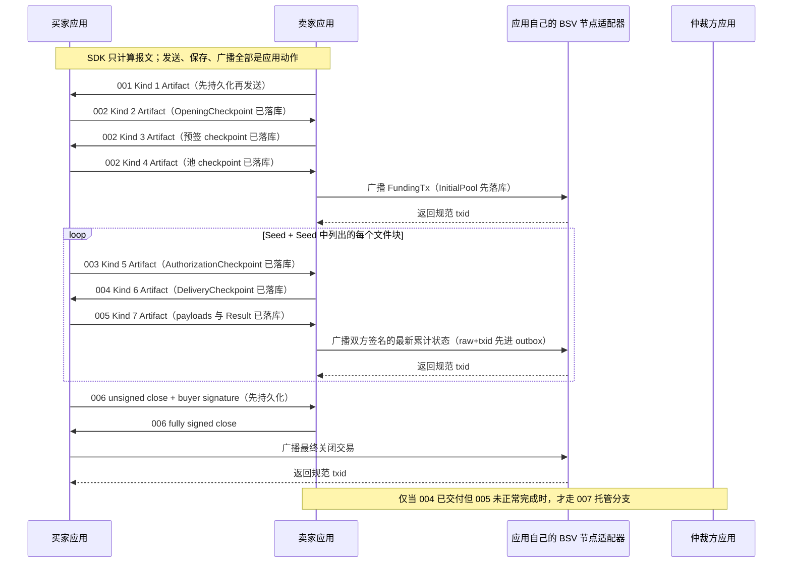

# 使用 go-bitfs 角色工作流完成一次文件购买业务

本文给出一个可直接映射为 Go 代码的端到端业务实现：卖家发布文件报价，买家建立 2-of-3 支付池，先购买 Seed，再按 Seed 顺序购买全部文件块，每块交付后完成一次累计付款，最后双方协商关闭支付池。

示例调用的是本仓库当前公开角色 API。go-bitfs 是**无状态、无基础设施副作用的协议 SDK**：角色 workflow 只持有构造时固定的受约束 Signer（本地软件私钥经 `protocol.NewPrivateKeySigner` 进入），只做协议计算与验证；时间与区块高度由调用方以 `protocol.Facts{Now, BlockHeight}` 显式传入。数据库、事务、锁、内容仓库、节点广播、时间源和高度来源全部由业务应用提供。

## 1. 业务目标与成功条件

本次业务使用三个角色：

- 买家：支付并接收文件；
- 卖家：提供报价、Seed 和文件块；
- 仲裁方：作为支付池第三方公钥参与开户，仅在异常分支中签署托管证据与付费交易。

为使主线清晰，本例购买的是非空文件；空文件的报价要求 `SeedHash` 为空，业务层应直接发布空结果，不进入购买 Seed/文件块的循环。

正常业务成功必须同时满足：

1. 买方用 `buyer.AcceptQuote` 从 exact bytes 验收了卖方签名的 001 报价；
2. 双方各自**先持久化 checkpoint、再发送报文**，完成 002 开池并广播资金交易；
3. 每轮都严格执行 003 请求、004 交付、005 累计付款；
4. 下载后的文件通过 MasterSeed 完整校验；
5. 双方完成 006 协商关池；最终交易由应用自己的节点适配器广播并被接受。

主流程如下：



## 2. SDK 与应用边界

| 能力 | 负责方 | 本例使用的接口 |
|---|---|---|
| 报价、内容凭证、定价和签名验证 | go-bitfs | `seller.Workflow`、`buyer.Workflow`、`content` 领域包 |
| 支付池交易构造、解析、签名合并 | go-bitfs | `pool.MultisigPoolEngine`（纯函数） |
| 报文编码与严格解析 | go-bitfs | `wire.Encode*` / `wire.ParseAs`，返回不可变 `wire.Artifact` |
| 私钥托管 | 应用经唯一端口注入 | `protocol.NewPrivateKeySigner(key)` → 角色 workflow 构造参数 |
| FundingTx 构建和签名 | 应用钱包 | `Wallet.BuildSignedFundingTransaction`（本文伪接口） |
| 全部本地角色状态持久化 | 应用数据库 | `PurchaseJournal`（本文伪接口），以 `RefundTemplateTxID` 与授权 ID 为键 |
| Seed、文件块读取与下载结果存储 | 应用 | `ContentRepository`（本文伪接口） |
| 时间源与区块高度来源 | 应用 | 每次调用组装一份 `protocol.Facts{Now, BlockHeight}` 显式传入 |
| 节点广播与链上对账 | 应用 | `NodeBroadcaster`（本文伪接口） |
| HTTP、队列、WebSocket | 应用 | 传输 `wire.Artifact.Bytes()` 的 exact bytes |

> go-bitfs 不提供任何 Store、Repository、租约或后端实现。若买卖双方是独立服务，各自持有自己的本地 checkpoint 即可——SDK 从不依赖共享存储。

### 2.1 应用侧推荐顺序：persist-before-send

每个协议步骤都遵循同一顺序，这是接入本 SDK 的核心纪律：

```
load（按 RefundTemplateTxID 或授权 ID 加载本地 checkpoint）
→ 角色 API compute/verify（显式传入全部前序证据与 Facts）
→ persist checkpoint/outbox（先保存返回的 Artifact 字节与 checkpoint）
→ send/broadcast（通过自己的传输与节点适配器发送 Outbound.Bytes()）
→ record outcome（记录 txid 与最终结果）
```

“先保存、再发送”适用于每一条对外报文：所有角色方法返回的 `Outbound` 都是待发送的 exact-bytes Artifact，必须连同对应 checkpoint 一起先落库。“先持久化 raw 与 canonical txid、再调用自己的广播器”适用于每一笔交易。

## 3. 应用需要实现的适配器

下面均为应用层伪代码。

### 3.1 密钥与事实

私钥只经受约束 Signer 端口进入 SDK；时间与高度每次调用显式传入。

```go
// 每个角色用自己的官方 BSV 私钥构造一个受约束 Signer，再交给角色 workflow。
// buyer、seller、arbiter 必须分别创建实例，不能混用角色密钥。
signerBuyer, err := protocol.NewPrivateKeySigner(buyerKey)
buyerWorkflow, err := buyer.NewWorkflow(signerBuyer)

// 显式事实：Now 是本操作唯一时间事实（UTC），BlockHeight 是唯一高度事实。
// SDK 不读系统时钟、不查节点；应用负责记录观测来源。
func factsAt(at time.Time, height uint32) protocol.Facts {
    return protocol.Facts{Now: at.UTC(), BlockHeight: height}
}
```

所有普通消息签名由 SDK 内部构造 digest 后交给 Signer 并固定自验；资金池交易签名使用固定的 MultisigPool sighash（`ForkID|All`）。注意：HSM 或远程托管可能为同一摘要产生不同但都有效的 DER 签名，SDK 不承诺 exactly-once 签名。应用应在对外发送前保存第一次成功结果，重试时优先重放已保存字节（见第 7 节）。

### 3.2 内容仓库

内容字节永远不经过 SDK 的存储钩子：调用方在调用前读出、作为命令字段传入，验证后的内容也由 SDK 作为返回值交还、由调用方落盘。

```go
// SellerContentRepository 保存卖家预先生成的 Seed 和文件块。
type SellerContentRepository struct{ /* ... */ }

func (r *SellerContentRepository) LoadSeed(seedHash masterseed.Digest) ([]byte, error)
func (r *SellerContentRepository) LoadBlock(blockHash masterseed.Digest) ([]byte, error)

// BuyerContentStore 保存买家已验证的内容。只有保存成功后，
// 业务才允许把对应的付款标记为可继续推进。
type BuyerContentStore struct{ /* ... */ }

func (s *BuyerContentStore) SaveVerifiedContent(contentHash [32]byte, payload []byte) error
```

### 3.3 节点广播适配器

广播、超时判定和链上对账完全属于应用。SDK 只会返回待广播的交易原文。

```go
// NodeBroadcaster 是应用自己的节点适配器。它声明"节点是否接受"，
// 这是 SDK 绝不代言的能力。
type NodeBroadcaster struct{ /* ... */ }

// Broadcast 先把 (raw, canonicalTxID) 写入应用的 outbox 表，再提交节点。
// 超时或结果不确定时，由调用方按 txid/outpoint 查询节点并对账，
// outbox 记录保证可以安全地重播同一笔交易。
func (b *NodeBroadcaster) Broadcast(raw []byte) (canonicalTxID [32]byte, err error) {
    transaction, err := pool.ParseCanonicalTransaction(raw)
    if err != nil {
        return [32]byte{}, err
    }
    txID := transaction.TxID().CloneBytes()
    if err := b.outbox.Save(txID, raw); err != nil {
        return [32]byte{}, err
    }
    return b.rpc.SendRawTransaction(raw)
}

// 区块高度来源。退款交易使用区块高度 nLockTime 时，应用必须提供一个
// 自己认可的当前高度；绝不能为了绕过失败而伪造 0 继续执行退款。
func (b *NodeBroadcaster) CurrentBlockHeight(ctx context.Context) (uint32, error)
```

### 3.4 原始协议流水（PurchaseJournal）

应用按两类键保存每一步返回值：费用池关联 ID `RefundTemplateTxID` 用于开池与付款状态；授权 ID `PaymentAuthorizationID`（= SHA-256(exact payment_authorization_cbor)，内容寻址键）用于索引精确的原始签名 003——找不到原始 003 就不能验收对应的付款凭证：

```go
// PurchaseJournal 是应用的业务状态库。表结构建议：
//
//   quotes(id PRIMARY KEY, kind1_raw, verified_terms_json)
//   pools(refund_template_txid PRIMARY KEY, role, opening_proof_cbor,
//         latest_payment_raw_tx)
//   buyer_openings(refund_template_txid PRIMARY KEY, kind2_raw, funding_tx_raw)
//   seller_presigns(refund_template_txid PRIMARY KEY, opening_checkpoint_cbor)
//   authorizations(payment_authorization_id PRIMARY KEY, kind5_raw,
//                  refund_template_txid, processing_status)
//   deliveries(payment_authorization_id PRIMARY KEY, delivery_checkpoint_json)
//   outbox(id PRIMARY KEY, kind_label, exact_bytes, created_at, sent_at)
type PurchaseJournal struct{ /* ... */ }

func (j *PurchaseJournal) SaveOutbox(kindLabel string, artifactBytes []byte) error // 发送前留痕
func (j *PurchaseJournal) SaveAuthorization(authID protocol.PaymentAuthorizationID, cp *buyer.AuthorizationCheckpoint) error
func (j *PurchaseJournal) LoadAuthorizationByID(authID protocol.PaymentAuthorizationID) (*buyer.AuthorizationCheckpoint, error)
func (j *PurchaseJournal) SaveDeliveryCheckpoint(cp *seller.DeliveryCheckpoint) error
func (j *PurchaseJournal) LoadDeliveryCheckpointByAuth(authID protocol.PaymentAuthorizationID) (*seller.DeliveryCheckpoint, error)
func (j *PurchaseJournal) SaveLatestPayment(role string, rawTx []byte) error
```

checkpoint 是 opaque 类型（字段私有、getter 防御性复制），持久化方式由应用自选：可以直接序列化其 evidence 原始字节（exact Kind 2 bytes + 资金交易原文、canonical opening proof 编码 + 付款 raw tx、exact Kind 5 bytes 等），恢复时用 SDK 提供的 Restore 入口全量重验：

```go
// 崩溃恢复三入口：全部从 exact bytes 重新派生，绝不信任持久化的派生值。
openingCP, err := buyer.RestoreOpeningCheckpoint(rawKind2, fundingTxRaw)
poolCP, err := buyer.RestorePoolCheckpoint(openingProofCBOR, paymentRawTx)
authCP, err := buyer.RestoreAuthorizationCheckpoint(rawKind5)
```

并发串行化同样由应用完成：同一 `RefundTemplateTxID` 的后续报文必须串行处理（数据库唯一键 + 行锁或单队列）。SDK 无锁，两次并发调用会产生两份各自合法的计算结果，去重是应用的责任。

## 4. 卖家预处理文件并创建报价

```go
ctx := context.Background()

// 内容仓库在报价之前准备好 Seed 与文件块；SDK 不读取磁盘。
seed, fileBytes := contentRepo.PrepareMasterSeedAndBlocks("bigfile.bin")

now := time.Now().UTC()
facts := factsAt(now, currentHeight) // 高度来自应用认可的事实源

// QuoteDraft 是唯一条款来源；RecommendedFilename 先 sanitize 再进入签名条款。
qr, err := sellerWorkflow.CreateQuote(ctx, facts, seller.QuoteDraft{
    SeedHash:                   masterseed.Sum256(seed).Bytes(),
    BuyerPublicKey:             buyerPubKey,
    SeedPriceSatoshis:          100,
    FullBlockPriceSatoshis:     1000,
    FileSizeBytes:              uint64(len(fileBytes)),
    QuoteExpiresAtUnixSeconds:  now.Add(24 * time.Hour).Unix(),
    SupportedArbiterPublicKeys: [][]byte{arbiterPubKey},
    RecommendedFilename:        "bigfile.bin",
})
if err != nil { /* ... */ }

// qr.Outbound 是 exact Kind 1 Artifact；qr.Terms 是实际签署的最终条款快照。
journal.SaveOutbox("quote", qr.Outbound.Bytes())
sendToBuyer(qr.Outbound.Bytes())
```

## 5. 初始化一次业务会话

```go
signerSeller, _ := protocol.NewPrivateKeySigner(sellerKey)
sellerWorkflow, _ := seller.NewWorkflow(signerSeller)
signerArbiter, _ := protocol.NewPrivateKeySigner(arbiterKey)
arbiterWorkflow, _ := arbiter.NewWorkflow(signerArbiter)
```

买家从 exact bytes 验收报价（过期判断只依赖 `facts.Now`，返回不可变 `content.VerifiedQuote`；不保存）：

```go
vq, err := buyerWorkflow.AcceptQuote(ctx, facts, receivedKind1Raw)
terms := vq.Terms()      // 最终规范化条款
_ = vq.ID()              // 报价 typed ID
_ = vq.AllowsArbiter(arbiterPubKey)
```

## 6. 端到端正常流程

### 6.1 002 开池（0201–0205）

```go
fundingTx := wallet.BuildSignedFundingTransaction(buyerPubKey, sellerPubKey, arbiterPubKey, poolOutputSat)

// 0201：SDK 返回待发送 Artifact 与必须先持久化的 OpeningCheckpoint。
prepared, err := buyerWorkflow.PreparePoolOpening(ctx, facts, buyer.PrepareOpeningCommand{
    Quote:                           vq,
    FundingTransactionRaw:           fundingTx,
    ExpiryLockTime:                  uint32(now.Add(time.Hour).Unix()),
    MinerFeeRateSatoshisPerKilobyte: feeRate,
    SellerPublicKey:                 sellerPubKey,
    ArbiterPublicKey:                arbiterPubKey,
})
if err != nil { /* ... */ }
openingCP := prepared.Checkpoint                       // 先持久化 checkpoint：
journal.SaveBuyerOpening(vq.ID(),                      //   exact Kind 2 bytes +
    prepared.Outbound.Bytes(),                         //   资金交易原文
    openingCP.RefundTemplateTxID().String())
journal.SaveOutbox("kind2", prepared.Outbound.Bytes())
sendToSeller(prepared.Outbound.Bytes())

// 0202：卖方验证请求并预签。同样先持久化再回应。
presign, err := sellerWorkflow.PreparePoolOpening(ctx, facts, receivedKind2Raw)
if err != nil { /* ... */ }
sellerPresignCP := presign.Checkpoint                  // 先落库
journal.SaveOutbox("kind3", presign.Outbound.Bytes())
sendToBuyer(presign.Outbound.Bytes())

// 0203：买家加载 0201 的 exact bytes 全量重验后显式传回。
restored, err := buyer.RestoreOpeningCheckpoint(savedKind2Raw, savedFundingTxRaw)
completed, err := buyerWorkflow.CompletePoolOpening(ctx, restored, receivedKind3Raw)
if err != nil { /* 关联 ID 错配或验签失败按分类拒绝 */ }
buyerPool := completed.InitialPool                     // 初始池 checkpoint
openingProofCBOR, _ := pool.EncodeOpeningProof(completed.Opening.Proof())
journal.SavePool("buyer", openingProofCBOR, nil)       // 尚无付款状态 raw tx

// 0204：打包已验证 opening 携带的资金交易。
deliveryArtifact, err := buyerWorkflow.PrepareFundingDelivery(ctx, buyerPool)
journal.SaveOutbox("kind4", deliveryArtifact.Bytes())
sendToSeller(deliveryArtifact.Bytes())

// 0205：卖方用自己保存的预签 checkpoint 验证资金交付。
opened, err := sellerWorkflow.VerifyFundingDelivery(ctx, sellerPresignCP, receivedKind4Raw)
if err != nil { /* ... */ }
journal.SaveLatestPayment("seller", opened.InitialPool.Payment().RawTx())
sellerPool = opened.InitialPool

// 广播资金交易：应用先持久化 raw 与 canonical txid，再调用节点适配器；
// InitialPool 在广播决策之前已经落库。
_, err = broadcaster.Broadcast(opened.FundingTransactionRaw)
if isTimeout(err) { /* 按 txid 对账后再决定是否重播；不要盲目重签 */ }
```

### 6.2 单次"请求—交付—付款"（003–005）

以下函数每次迭代都以应用数据库中的最新状态为输入：

```go
func purchaseOneRound(journal *PurchaseJournal, height uint32) error {
    ctx := context.Background()
    now := time.Now().UTC()
    facts := factsAt(now, height)

    // 003：引用、批量价格、余额、序号连续性全部基于显式传入的状态校验。
    rc, err := buyerWorkflow.RequestContent(ctx, facts, buyer.RequestContentCommand{
        Quote:            vq,
        Pool:             buyerPool,
        ContentHashes:    wantedHashes, // 有序批次；含块时必须携带已验证 seed
        DeliveryDeadline: content.UnixSeconds(now.Add(30 * time.Minute).Unix()),
        Seed:             buyerSeedForBlock,
    })
    if err != nil { return classify(err) }

    // 先持久化授权 checkpoint（含 exact 已签 003）与出站字节，再发送。
    journal.SaveAuthorization(rc.AuthorizationID, rc.Checkpoint)
    rawKind5 := rc.Outbound.Bytes()
    journal.SaveOutbox("kind5", rawKind5)
    sendToSeller(rawKind5)

    // 004：卖方验证整批授权，逐项校验 payload 后原子交付整批。
    dr, err := sellerWorkflow.DeliverContent(ctx, factsAt(now, height), seller.DeliveryCommand{
        Quote:           signedQuote,
        Pool:            sellerPool,
        RequestRaw:      rawKind5OnSellerSide,
        ContentPayloads: loadedPayloadBatch, // 顺序与 003 hashes 一一对应
        Seed:            repoSeed,
    })
    if err != nil { return classify(err) }
    journal.SaveDeliveryCheckpoint(dr.Checkpoint) // 先保存交付上下文
    journal.SaveOutbox("kind6", dr.Outbound.Bytes())
    sendToBuyer(dr.Outbound.Bytes())

    // 买家按 PaymentAuthorizationID 路由 004 到本地保存的授权 checkpoint 后
    // 全量验收；payload 批次是数据，落盘由应用完成。
    pp, err := buyerWorkflow.VerifyDeliveryAndPreparePayment(ctx, facts, buyer.VerifyDeliveryCommand{
        Quote:       vq,
        Pool:        buyerPool,
        Request:     savedAuthCheckpoint,
        DeliveryRaw: receivedKind6Raw,
        Seed:        localSeed,
    })
    if err != nil { return classify(err) }
    for index, payload := range pp.Payloads {
        if err := contentStore.SaveVerifiedContent(wantedHashes[index], payload); err != nil {
            // 任一项保存失败都不得声称业务已完成；可复用同一验证结果重新落盘。
            return err
        }
    }
    // 先持久化 payloads 与 Result，再发送整批唯一的 Kind 7 凭证。
    rawKind7 := pp.Outbound.Bytes()
    journal.SaveOutbox("kind7", rawKind7)
    sendToSeller(rawKind7)

    // 005：卖方按授权 ID 取回原始签名 003，交叉核对交付 checkpoint 后补签合并。
    authCP, err := journal.LoadAuthorizationByID(ppAuthorizationID())
    if err != nil { return err } // 授权 ID 不可解码：找不到原始 003 就不能验收
    deliveryCP, err := journal.LoadDeliveryCheckpointByAuth(ppAuthorizationID())
    if err != nil { return err }
    completedPay, err := sellerWorkflow.CompletePayment(ctx, factsAt(now, height), seller.PaymentCommand{
        Pool:       sellerPool,
        Request:    authCP.Request(),
        UpdateRaw:  receivedKind7Raw,
        Checkpoint: deliveryCP,
    })
    if err != nil { return classify(err) }

    // 节点确认前：完整双签候选 raw 先落库；业务 accepted 记录暂不推进。
    rawTx := completedPay.Transaction.RawTx()
    journal.SavePendingPayment(rawTx)
    _, err = broadcaster.Broadcast(rawTx)
    if err != nil { return err }

    // 节点确认或对账清楚之后，双方把各自 checkpoint 推进到同一确认状态：
    // 卖方直接使用 NextPool；买方可用 canonical opening proof + 完整付款
    // raw tx 经 RestorePoolCheckpoint 全量重验恢复。
    sellerPool = completedPay.NextPool
    restoredBuyerPool, err := buyer.RestorePoolCheckpoint(buyerOpeningProofCBOR, rawTx)
    if err != nil { return err } // 双签状态不完整，绝不能作为下一轮 previous
    buyerPool = restoredBuyerPool
    return nil
}

func classify(err error) error {
    switch {
    case protocol.IsCode(err, protocol.CodeExpired):
        // 报价过期/截止已过：终止本轮或重新要报价。
    case protocol.IsCode(err, protocol.CodeStateConflict):
        // 序号陈旧或 checkpoint 错配：刷新本地确认状态后重试。
    case protocol.IsCode(err, protocol.CodeInsufficientBalance):
        // 聚合价格超出余额：拆批或终止。
    default:
        // malformed_wire/non_canonical/invalid_signature 等分类见下表。
    }
    return err
}
```

区块高度由应用从自己认可的节点适配器读取后显式传入 Facts；时间同样由应用观测后传入。SDK 不查节点，也不评估调用方事实的可信度。

### 6.3 006 协商关池

```go
base := buyerPool.Payment() // 调用方选定的基准状态；SDK 不声称它是业务最新

// 买家构造最终未签名交易和自己的分离签名；两者都要先持久化再发送。
closePrep, err := buyerWorkflow.PrepareClose(ctx, facts, buyer.PrepareCloseCommand{
    Pool:                       buyerPool,
    Base:                       base,
    TargetSellerAmountSatoshis: targetSellerAmountSatoshis,
})
if err != nil { /* ... */ }
journal.SaveCloseIntent(closePrep.Unsigned.RawTx, closePrep.BuyerSignature)

// 卖家验证买家签名、补充卖方签名并合并；不广播。
closed, err := sellerWorkflow.CompleteClose(ctx, facts, seller.CloseCommand{
    Pool:           sellerPool,
    Unsigned:       closePrep.Unsigned,
    BuyerSignature: closePrep.BuyerSignature,
})

// 买家复核完整最终交易；广播由买家执行。
verified, err := buyerWorkflow.VerifyCompletedClose(ctx, buyer.VerifyCloseCommand{
    Pool:  buyerPool,
    Close: closed,
})
_, err = broadcaster.Broadcast(verified.RawTx())
```

到期退款路径同样是显式事实驱动的纯计算：

```go
// 只有 facts 判定退款锁定已到期才会成功；未到期按 CodeNotMatured 分类拒绝。
refund, err := buyerWorkflow.BuildMaturedRefund(ctx, facts, buyerPool)
_, err = broadcaster.Broadcast(refund.RawTx())
```

### 6.4 007 托管分支（004 已交付但 005 未完成）

```go
// 卖方：从本地池 checkpoint、exact 已签 003 与本方已发的 exact Kind 6
// 构造 Claim 证据并签署，得到待发送 Kind 8 Artifact。
kind8Artifact, err := sellerWorkflow.PrepareArbitration(ctx, facts, seller.ArbitrationCommand{
    Pool:        sellerPool,
    Request:     savedAuthCheckpoint.Request(),
    DeliveryRaw: sentKind6Raw,
})
rawKind8 := kind8Artifact.Bytes() // 应用先持久化 exact Kind 8 再发送

// 生产服务必须在计价之前完成链上 UTXO 前置检查（outpoint 存在、金额与
// Claim 一致、script 与池锁一致、已确认且未花费）；查询失败、超时或状态
// 不确定时拒绝签名，不得降级继续。SDK 不查节点。
// 应用先按自己的收费策略对 exact payload CBOR 长度计价（整数公式，无浮点），
// 再把明确金额交给 SDK；SDK 只验证正数与容量，不注入任何费率策略。
fee := protocol.Satoshis(arbiterFeePolicy(len(payloadBundleCBOR)))

// 仲裁方第一阶段：完整验证但绝不签名；需要 Facts.Now（deadline）与
// Facts.BlockHeight（退款模板门禁）。
prepared, err := arbiterWorkflow.PrepareArbitration(ctx, facts, rawKind8, fee)
if err != nil { /* ... */ }

// 应用在这里原子持久化托管证据：exact request 字节（prepared.RequestCBOR()）、
// Claim ID、冻结费用与 payload bundle；只追加、不覆盖。
journal.PersistArbitrationCustody(prepared)

// 仲裁方第二阶段：基于冻结的 exact Kind 8 字节独立重建交易与 digest，重新
// 比对 Claim ID、费用、角色与 deadline 后按固定顺序签名。
kind9Artifact, err := arbiterWorkflow.SignPreparedArbitration(ctx, facts, prepared)
rawKind9 := kind9Artifact.Bytes() // 签名后追加 exact canonical Kind 9 到原记录
journal.SaveExactArbitrationResponse(rawKind9)

// 卖方：从 exact Kind 8/9 完整验证托管收款路径，补签并合并完整交易。
signed, err := sellerWorkflow.CompleteArbitratedPayment(ctx, facts, seller.ArbitratedPaymentCommand{
    RequestRaw:           rawKind8,
    ResponseRaw:          rawKind9,
    DeliveryPayloadsCBOR: savedPayloadBundleCBOR, // 可选；提供时逐字节比对
})
_, err = broadcaster.Broadcast(signed.RawTx())
```

### 6.5 008 买方托管取回（Seller/Buyer 无法直连时）

007 完成后，"仲裁方持有 Buyer 已授权内容的精确 payload"已是协议事实。Seller 与 Buyer 无法直连时，Buyer 从托管记录取回内容。取件是只读恢复：**不生成、不签名、不返回任何付款凭证**；也不存在 Buyer+Arbiter 关池——Seller 失联或拒绝协商关池时，Buyer 等 refund locktime 成熟后用 `BuildMaturedRefund` 广播 002 的预签名退款。

```go
// Buyer：凭池 checkpoint + exact 已签 003 构造 Kind 10。
// 默认入口由 SDK 生成安全随机 nonce；网络超时重试必须原样重放已持久化的
// Artifact，绝不能重新调用本方法生成新 nonce。
k10Artifact, err := buyerWorkflow.RequestArbitratedContent(ctx, buyer.ArbitrationRetrievalCommand{
    Pool:          buyerPool,
    Authorization: savedAuthCheckpoint,
})
rawKind10 := k10Artifact.Bytes()
journal.SaveOutbox("kind10", rawKind10) // 发送前持久化 exact Kind 10
sendToArbiter(rawKind10)

// Arbiter 应用：固定顺序处理。
requestID := retrievalRequestIDOf(rawKind10) // SHA-256(exact request 文档)，应用派生
record, ok := custodyStore.Lookup(requestID)
switch {
case !ok:
    // not_received：没有托管记录就无法鉴权 Buyer——签名的 unavailable 应答，
    // 不占用任何状态；生产实现必须限流且不泄露记录元数据。
    answer, _ := arbiterWorkflow.BuildUnavailableRetrieval(ctx, requestID,
        arbitration.RetrievalSellerArbitrationNotReceived)
    return answer.Bytes()
case !record.Retrievable():
    // 只有 exact Kind 8：鉴权后签名的 not_ready。
    if err := arbiterWorkflow.AuthenticateRetrieval(rawKind10, record.StoredKind8()); err != nil {
        return ErrUnauthorized // 统一语义，不说明哪个字段失败
    }
    answer, _ := arbiterWorkflow.BuildUnavailableRetrieval(ctx, requestID,
        arbitration.RetrievalSellerArbitrationNotReady)
    custodyStore.CommitFirstAnswer(requestID, answer.Bytes()) // 原子提交首次应答
    return answer.Bytes()
default:
    // 完整托管记录：全量验证 Kind 8/9 + 鉴权 Kind 10，再绑定验证过的 payload。
    custody, err := arbiterWorkflow.VerifyRetrievableCustody(rawKind10,
        record.StoredKind8(), record.StoredKind9())
    answer, err := arbiterWorkflow.BuildAvailableRetrieval(ctx, requestID, custody)
    custodyStore.CommitFirstAnswer(requestID, answer.Bytes())
    return answer.Bytes()
}

// Buyer：完整验收（时间无关）并保存。
outcome, err := buyerWorkflow.VerifyArbitratedContent(ctx, buyer.ArbitratedContentCommand{
    Quote:               vq,
    Pool:                buyerPool,
    Request:             savedAuthCheckpoint,
    RetrievalRequestRaw: rawKind10,           // 原样重放，绝不换 nonce
    RetrievalResponseRaw: receivedKind11Raw,
    Seed:                seedBytes,
})
if outcome.Available {
    journal.SaveExactKind11AndPayloads(receivedKind11Raw, outcome.Payloads) // 验收后保存
} else {
    // unavailable 是已验签协议结果（typed result，不是 error）：
    // 按 outcome.UnavailableReason 决定换新 nonce、等待或终止。
}
_ = outcome.ContentRetrievalRequestID
_ = outcome.ArbitrationClaimID // 审计数据按应用策略落盘
```

验收与重放对照（三条取件语义）：

```text
网络超时 / 响应未收完   -> 重发相同 exact Kind 10（幂等，Arbiter 原样返回首次 Kind 11）
明确收到 not_ready      -> 新 nonce、新 Kind 10 重试
相同请求重放            -> 逐字节原样重发第一次持久化的 Kind 11
```

| 场景 | 正确做法 |
|---|---|
| 请求查不到托管记录 | 返回**签名的** `not_received` unavailable 应答；不泄露记录是否存在之外的信息，并对随机查询限流。 |
| 只有 Kind 8，Kind 9 未签署 | `AuthenticateRetrieval` 鉴权后返回**签名的** `not_ready` 并持久化为该请求唯一答案；Buyer 明确收到 not_ready 后用新 nonce 重试。 |
| NotReady 提交前 Kind 9 才落地 | 提交临界区复核状态：放弃 NotReady，按最新完整快照改答 available。 |
| Buyer 签名不属于 Claim 的 Buyer key | 鉴权拒绝（统一 Unauthorized 语义）；不污染 nonce 占用表。 |
| 相同 exact Kind 10 重放 | 原样重发第一次持久化的 Kind 11（任何分支），绝不重新评估或升级。 |
| retention 结束且已安全删除 | **签名的** `custody_gone`；已持久化首次响应随内容一起删除，重复执行 retention 不得再删除 tombstone 状态下已提交的应答。 |
| 发送超时 / 未收完 | 优先**重发相同 exact Kind 10**（幂等重放）；只有明确收到 not_ready 才换新 nonce。 |
| 取件时 Quote/deadline/refund 已过期 | 只要记录仍在 retention 内就正常验收——事后取件不重新执行时间门禁。 |

## 7. 错误分类与重试策略

错误处理只用稳定分类断言，绝不匹配错误文本：

```go
switch {
case protocol.IsCode(err, protocol.CodeMalformedWire):        // 报文结构畸形
case protocol.IsCode(err, protocol.CodeNonCanonical):         // 编码非规范
case protocol.IsCode(err, protocol.CodeUnsupportedVersion):   // 版本不支持
case protocol.IsCode(err, protocol.CodeUnsupportedKind):      // Kind 不支持或路由不一致
case protocol.IsCode(err, protocol.CodeInvalidSignature):     // 消息/交易签名验证失败
case protocol.IsCode(err, protocol.CodeInvalidEvidence):      // 证据链/业务约束拒绝
case protocol.IsCode(err, protocol.CodeUnauthorized):         // 角色公钥不符
case protocol.IsCode(err, protocol.CodeExpired):              // 报价/截止/退款锁定已过
case protocol.IsCode(err, protocol.CodeNotMatured):           // 退款锁定尚未到期
case protocol.IsCode(err, protocol.CodeStateConflict):        // 序号陈旧/checkpoint 错配
case protocol.IsCode(err, protocol.CodeInsufficientBalance):  // 超出余额或容量
case protocol.IsCode(err, protocol.CodeCanceled):             // context 取消/超时
case protocol.IsCode(err, protocol.CodeSignerUnavailable):    // 密钥托管暂时不可用
}
```

| 场景 | 正确做法 |
|---|---|
| Prepare 后托管保存失败 | 回滚/标记不完整，绝不调用 `SignPreparedArbitration`；SDK 没有数据库副作用。 |
| Kind 9 保存成功但发送失败 | 重发**同一份**已保存 canonical response bytes，不重签、不改回执金额。 |
| 任一 wire 报文发送超时 | 重发**同一份**已持久化的 Outbound exact bytes（幂等）；绝不基于同一输入重新计算新报文——HSM 签名不保证逐字节相同。 |
| Kind 10 取件超时 | 重放已持久化的 exact Kind 10；只有明确收到 not_ready（typed 结果）才换新 nonce 重新构造。 |
| 广播超时 / 结果不确定 | 应用先持久化 raw 与 canonical txid，再按 txid/outpoint 查询节点对账；outbox 保证可安全重播。SDK 不保存 uncertain 标记。 |
| 重复 / 乱序 / 并发报文 | 应用按 Claim ID 幂等索引 exact request 与已签响应；同 Claim ID 不同 exact Claim bytes 是冲突或 hash collision，停止自动流程并报警，不覆盖原记录。 |
| 仲裁费超出 Buyer 剩余余额 | `PrepareArbitration` 以 `CodeInsufficientBalance` 分类拒绝并**放弃本次仲裁**：不生成、不保存、不发送 Kind 9；不得自动截断、下调或改写费用，也不得产生免费或部分收费响应。若业务允许重新报价，必须作为新的应用层决策重新进入验证流程，且不得覆盖已经托管或签署的记录。 |
| UTXO 查询超时 / 结果不确定 | 不把“不确定”当作可花费，不产生新签名；保存状态后重试查询，必要时进入人工/重试对账。 |
| delivery deadline 在持久化间隙内到期 | `SignPreparedArbitration` 用本次 Facts.Now 重新检查并以 `CodeExpired` 拒绝；已持久化证据保留为失败审计记录。 |
| stale sequence / 金额倒退 / wrong source context | SDK 从 Buyer 绝对授权独立重建；应用按 `(RefundTemplateTxID, PaymentSequence)` high-water 和广播对账策略拒绝或人工处理。 |
| 多租户 | 先做账户授权再加载证据；`RefundTemplateTxID` 是路由 ID 不是授权令牌；SDK 会继续校验 Signer 公钥与协议角色的绑定。 |

## 8. 分布式部署必须增加的状态同步

买卖双方是独立服务时，各自维护自己的状态即可，但必须遵守：

1. 所有跨步骤恢复所需的信息都在各自主体的数据库里：买方的开池 checkpoint（exact Kind 2 bytes + 资金交易原文）、双方的 canonical opening proof 与最新付款 raw tx、卖方的预签 checkpoint 与交付 checkpoint、双方的授权 checkpoint（exact Kind 5 bytes）；
2. 恢复一律用 Restore 入口从 exact bytes 全量重验，不信任持久化的派生字段；
3. 每个跨网络动作前先持久化意图与材料（outbox），动作后记录结果；
4. 不要求多个网络步骤处于同一数据库事务；应用用自己的状态机衔接。

## 9. 验收清单

- [ ] workflow 构造只剩一个受约束 Signer（本地软件私钥经 `protocol.NewPrivateKeySigner`），代码中不存在任何 Store/Backend 注入；
- [ ] 时间与高度全部以 `protocol.Facts{Now, BlockHeight}` 显式传入，代码中不存在 SDK 读钟路径；
- [ ] 每一步都是：load → 角色 API compute/verify → persist checkpoint/outbox → send/broadcast → record；
- [ ] 所有出站报文都以 `artifact.Bytes()` 的 exact 形态持久化后原样重发；
- [ ] `RefundTemplateTxID` 与授权 ID 是仅有的两类查找键，所有错配拒绝围绕它们展开；
- [ ] 内容字节由应用读取传入、验证结果由应用落盘；
- [ ] 广播超时的对账逻辑位于应用节点适配器中，且先于任何"已完成"声明；
- [ ] 错误分支只使用 `protocol.IsCode(err, protocol.CodeXxx)` 分类断言。
